# ARTEFAK 01 — DESAIN DATABASE & ERD CUTWAYWHATSAPP

**Untuk:** Product Owner / Founder CutwayWhatsApp
**Tujuan Dokumen:** Menjelaskan seluruh desain database secara lengkap, detail, dan mudah dipahami — walaupun Anda bukan programmer. Dokumen ini adalah "peta data" dari seluruh sistem CutwayWhatsApp.
**Catatan:** Dokumen ini **tidak berisi kode program**. Ini adalah cetak biru (blueprint) database yang akan digunakan tim engineering untuk membangun sistem.

---

## Cara Membaca Dokumen Ini

Sebelum masuk ke detail, berikut beberapa istilah dasar yang akan sering muncul, dijelaskan dengan bahasa sederhana:

| Istilah | Penjelasan Sederhana |
|---|---|
| **Tabel** | Seperti sebuah spreadsheet Excel — punya baris (data) dan kolom (jenis informasi) |
| **Kolom** | Satu jenis informasi dalam tabel, misalnya "nama", "email", "tanggal dibuat" |
| **Primary Key (PK)** | "KTP" dari satu baris data — nilai unik yang tidak boleh sama dengan baris lain, digunakan untuk mengenali data tersebut |
| **Foreign Key (FK)** | "Penghubung" antar tabel — misalnya kolom di tabel Kontak yang menunjuk ke tabel Organisasi mana pemilik kontak tersebut |
| **Index** | Seperti daftar isi buku — membuat pencarian data jadi jauh lebih cepat |
| **Constraint** | Aturan yang dipaksakan oleh database, misalnya "email tidak boleh kosong" atau "nomor telepon harus unik" |
| **UUID** | Kode acak unik sepanjang 36 karakter yang digunakan sebagai "KTP" data, menggantikan angka urut sederhana (1, 2, 3, ...) |
| **Multi-Tenant** | Satu sistem yang melayani banyak perusahaan/pelanggan sekaligus, tetapi data masing-masing perusahaan terpisah dan tidak bisa saling terlihat |
| **Soft Delete** | "Menghapus" data tanpa benar-benar menghapusnya dari database — hanya ditandai sebagai "terhapus" agar bisa dipulihkan atau untuk keperluan audit |

---

## 1. Tujuan Database

Database CutwayWhatsApp dirancang untuk menjadi **satu sumber kebenaran (single source of truth)** bagi seluruh data platform, dengan tujuan utama:

1. **Menyimpan data seluruh pelanggan (tenant) secara terpisah dan aman** — data milik PT A tidak boleh pernah bisa diakses oleh PT B, meskipun berada di database yang sama.
2. **Mendukung seluruh 30 modul bisnis** — mulai dari Autentikasi, Organisasi, Billing, koneksi WhatsApp, Inbox, Broadcast, CRM, Workflow Automation, sampai AI Agent dan Knowledge Base.
3. **Menjamin data tidak hilang dan bisa dilacak** — setiap perubahan data penting (siapa mengubah apa, kapan) tercatat dalam audit log.
4. **Siap untuk skala besar** — dari 1 pengguna UMKM sampai ribuan agen di perusahaan Enterprise/Government, tanpa perlu mendesain ulang database dari awal.
5. **Mendukung kepatuhan (compliance)** — terutama untuk pelanggan tingkat Enterprise dan Government yang membutuhkan jejak audit, retensi data, dan kontrol akses yang ketat.
6. **Menjadi fondasi otomasi dan AI** — data yang terstruktur dengan baik memungkinkan Workflow Automation dan AI Agent bekerja secara akurat dan bisa diaudit.

---

## 2. Arsitektur Database

### 2.1 Gambaran Umum

CutwayWhatsApp menggunakan **satu database PostgreSQL** yang dibagi secara logis berdasarkan `organization_id` (ID Organisasi/Perusahaan). Ini disebut model **"Pooled Database, Shared Schema"** — semua pelanggan berbagi struktur tabel yang sama, tetapi data mereka dipisahkan oleh kolom penanda tenant.

```
                     ┌─────────────────────────────────────┐
                     │        1 Database PostgreSQL         │
                     │                                       │
                     │   ┌───────────┐   ┌───────────┐       │
                     │   │  Data PT A │   │  Data PT B │      │
                     │   │ (org_id=A) │   │ (org_id=B) │      │
                     │   └───────────┘   └───────────┘       │
                     │                                       │
                     │   Dipisahkan otomatis oleh sistem     │
                     │   keamanan Row-Level Security (RLS)   │
                     └─────────────────────────────────────┘
```

### 2.2 Lapisan Keamanan Ganda (Defense in Depth)

Pemisahan data antar tenant dijaga oleh **dua lapis keamanan**, bukan hanya satu:

1. **Lapis Aplikasi (Backend):** Setiap permintaan data ke database otomatis disaring berdasarkan `organization_id` milik pengguna yang login.
2. **Lapis Database (Row-Level Security/RLS):** PostgreSQL sendiri memasang "pagar" di setiap tabel, sehingga meskipun ada kesalahan kode di aplikasi, database tetap menolak menampilkan data milik tenant lain.

Pendekatan dua lapis ini penting karena **kesalahan kode adalah risiko manusia yang wajar terjadi** — tetapi kebocoran data antar pelanggan adalah risiko bisnis yang fatal (bisa merusak reputasi dan kepercayaan). Dua lapis keamanan memastikan satu kesalahan saja tidak berakibat bencana.

### 2.3 Jalur Pertumbuhan (Growth Path)

Untuk pelanggan besar (Enterprise/Government) yang membutuhkan isolasi lebih tinggi (misalnya karena regulasi pemerintah), database bisa ditingkatkan ke:

- **Tahap 1 (Default):** Shared database, dipisah oleh `organization_id` — cocok untuk 95% pelanggan.
- **Tahap 2 (Opsional, Enterprise):** Schema terpisah dalam database yang sama.
- **Tahap 3 (Opsional, Government):** Database terpisah sepenuhnya, bisa di region/server khusus.

Perpindahan antar tahap ini **tidak memerlukan penulisan ulang aplikasi** karena struktur tabelnya identik — hanya routing koneksi database yang berbeda.

---

## 3. Alasan Memilih PostgreSQL

PostgreSQL dipilih sebagai mesin database utama CutwayWhatsApp karena beberapa alasan konkret:

| Alasan | Penjelasan Bisnis |
|---|---|
| **Keandalan (ACID)** | Data transaksi (misalnya pembayaran, perubahan status subscription) dijamin konsisten — tidak ada data yang "setengah tersimpan" akibat error. |
| **Row-Level Security (RLS)** | Fitur bawaan PostgreSQL yang memungkinkan pemisahan data multi-tenant di level database, bukan hanya di level aplikasi. |
| **Dukungan JSONB** | Memungkinkan data fleksibel (misalnya custom field kontak yang berbeda-beda per pelanggan) disimpan tanpa perlu mengubah struktur tabel setiap kali ada kebutuhan baru. |
| **Ekstensi pgvector** | PostgreSQL bisa menyimpan dan mencari "embedding" (representasi angka dari teks) — inilah yang membuat fitur AI Agent dan Knowledge Base (RAG) bisa berjalan tanpa perlu database terpisah di awal. |
| **Partitioning bawaan** | Tabel dengan data sangat besar (seperti pesan WhatsApp) bisa dipecah otomatis per bulan, membuat query tetap cepat meskipun data sudah bertahun-tahun. |
| **Open Source & Matang** | Tidak ada biaya lisensi, didukung komunitas besar, dan telah digunakan oleh perusahaan besar dunia selama puluhan tahun — risiko ketergantungan vendor (vendor lock-in) rendah. |
| **Kompatibel dengan Cloud Manapun** | Bisa dijalankan di AWS RDS, Google Cloud SQL, Azure, atau server sendiri — memberi fleksibilitas negosiasi biaya infrastruktur di masa depan. |

**Kesimpulan bisnis:** PostgreSQL memungkinkan CutwayWhatsApp memulai dengan biaya rendah (satu database, satu mesin), namun tetap punya jalur jelas untuk berkembang ke skala enterprise tanpa migrasi teknologi yang menyakitkan.


---

## 4. Struktur Database Lengkap

Database CutwayWhatsApp dikelompokkan menjadi **10 kelompok fungsional (domain)**, mengikuti 30 modul bisnis yang sudah dirancang sebelumnya. Setiap kelompok berisi beberapa tabel yang saling berhubungan.

| No | Kelompok Domain | Modul Terkait | Jumlah Tabel Inti |
|---|---|---|---|
| 1 | Identitas & Akses | Autentikasi, User Management, Roles, Permissions | 7 |
| 2 | Organisasi & Bisnis | Organization, Settings, Team Collaboration | 5 |
| 3 | Langganan & Pembayaran | Subscription, Billing | 8 |
| 4 | Koneksi WhatsApp | WhatsApp Connection | 2 |
| 5 | Percakapan & Pesan | Inbox, Live Chat | 3 |
| 6 | Kontak & Segmentasi | Contacts, Segments, Labels | 6 |
| 7 | Broadcast & Template | Broadcast, Template Messages | 6 |
| 8 | CRM | CRM (Pipeline & Deal) | 4 |
| 9 | Otomasi (Workflow) | Workflow Automation | 6 |
| 10 | Kecerdasan Buatan (AI) | AI Agent, Knowledge Base | 8 |
| 11 | Integrasi & API | Webhook, REST API | 6 |
| 12 | Operasional & Kepatuhan | Notification, Audit Log, File Storage, Media Library, Import/Export | 9 |

**Total: ± 70 tabel** yang saling berelasi dalam satu database PostgreSQL.

Semua tabel (kecuali `users` dan beberapa tabel katalog global seperti `plans` dan `permissions`) memiliki kolom `organization_id` yang menandai tabel tersebut **tenant-scoped** (data milik satu perusahaan tertentu).

### 4.1 Aturan Desain yang Berlaku di SEMUA Tabel

Agar konsisten dan mudah dirawat, setiap tabel di CutwayWhatsApp — kecuali dinyatakan berbeda — mengikuti aturan baku berikut:

1. **Primary Key** selalu bernama `id`, bertipe **UUID**, dibuat otomatis oleh database.
2. **Kolom Waktu:** `created_at` (kapan data dibuat) dan `updated_at` (kapan terakhir diubah) — otomatis terisi oleh sistem, tidak bisa dikosongkan.
3. **Kolom Tenant:** `organization_id` — menandai data ini milik perusahaan mana. Wajib ada di semua tabel tenant-scoped, dan selalu diberi index.
4. **Soft Delete:** `deleted_at` — dikosongkan (NULL) secara default; hanya terisi tanggal jika data "dihapus" oleh pengguna (lihat Bagian 13).
5. **Audit otomatis** untuk tabel-tabel sensitif (lihat Bagian 14).

---

## 5. Daftar Seluruh Tabel

Berikut adalah daftar lengkap seluruh tabel dalam database CutwayWhatsApp, dikelompokkan per domain. Penjelasan detail setiap tabel (kolom, tipe data, relasi, dll.) ada di **Bagian 6**.

### Kelompok 1 — Identitas & Akses
1. `users` — Data akun pengguna (bisa dipakai lintas organisasi)
2. `organization_members` — Keanggotaan pengguna dalam satu organisasi
3. `refresh_tokens` — Token untuk memperpanjang sesi login
4. `two_factor_secrets` — Data verifikasi dua langkah (2FA)
5. `roles` — Daftar peran/jabatan akses (Owner, Admin, Agent, dll.)
6. `permissions` — Daftar hak akses granular (misalnya "boleh export kontak")
7. `role_permissions` — Penghubung antara peran dan hak akses

### Kelompok 2 — Organisasi & Bisnis
8. `organizations` — Data perusahaan/pelanggan (akar dari semua data tenant)
9. `organization_settings` — Konfigurasi pengaturan organisasi
10. `user_preferences` — Preferensi pribadi setiap pengguna
11. `teams` — Data tim internal dalam organisasi
12. `team_members` — Keanggotaan pengguna dalam tim

### Kelompok 3 — Langganan & Pembayaran
13. `plans` — Katalog paket berbayar (Starter, Pro, Enterprise, dll.)
14. `plan_features` — Batasan/fitur setiap paket
15. `subscriptions` — Status langganan aktif setiap organisasi
16. `subscription_usage` — Pemakaian kuota organisasi (pesan, AI token, dll.)
17. `invoices` — Data faktur/invoice
18. `invoice_items` — Rincian item dalam satu invoice
19. `payments` — Riwayat transaksi pembayaran
20. `payment_methods` — Metode pembayaran tersimpan (kartu, dll.)

### Kelompok 4 — Koneksi WhatsApp
21. `whatsapp_accounts` — Akun WhatsApp Business (WABA) yang terhubung
22. `phone_numbers` — Nomor WhatsApp yang aktif digunakan

### Kelompok 5 — Percakapan & Pesan
23. `conversations` — Sesi percakapan dengan satu kontak
24. `messages` — Setiap pesan yang dikirim/diterima
25. `conversation_assignments` — Riwayat penugasan agen ke percakapan

### Kelompok 6 — Kontak & Segmentasi
26. `contacts` — Data kontak/pelanggan dari WhatsApp
27. `contact_custom_fields` — Definisi kolom tambahan khusus per organisasi
28. `contact_field_values` — Nilai dari kolom tambahan tersebut
29. `segments` — Kelompok kontak berdasarkan kriteria tertentu
30. `segment_rules` — Aturan/kriteria pembentuk segmen
31. `segment_members` — Daftar kontak yang termasuk dalam segmen

### Kelompok 7 — Broadcast & Template
32. `labels` — Label/tag yang bisa ditempel ke kontak, percakapan, atau deal
33. `label_assignments` — Penghubung label ke data lain
34. `message_templates` — Template pesan yang disetujui Meta/WhatsApp
35. `template_variables` — Variabel isian dalam template
36. `template_approval_history` — Riwayat status persetujuan template
37. `campaigns` — Kampanye broadcast
38. `campaign_recipients` — Daftar penerima dalam satu kampanye
39. `campaign_stats` — Ringkasan statistik hasil kampanye

### Kelompok 8 — CRM
40. `pipelines` — Jalur penjualan/proses bisnis
41. `pipeline_stages` — Tahapan dalam satu pipeline
42. `deals` — Peluang/transaksi bisnis dengan kontak
43. `deal_activities` — Riwayat aktivitas dalam satu deal

### Kelompok 9 — Otomasi (Workflow)
44. `workflows` — Definisi satu alur otomasi
45. `workflow_versions` — Riwayat versi dari satu workflow
46. `workflow_nodes` — Setiap "kotak" langkah dalam workflow
47. `workflow_edges` — Garis penghubung antar kotak/node
48. `workflow_runs` — Riwayat eksekusi workflow
49. `workflow_run_logs` — Log detail setiap langkah eksekusi

### Kelompok 10 — Kecerdasan Buatan (AI)
50. `ai_agents` — Konfigurasi asisten AI per organisasi
51. `ai_agent_configs` — Pengaturan tambahan yang fleksibel per AI Agent
52. `ai_conversation_memory` — "Ingatan" AI terhadap satu percakapan
53. `ai_logs` — Catatan setiap kali AI merespons (untuk audit & biaya)
54. `kb_collections` — Kumpulan dokumen pengetahuan (Knowledge Base)
55. `kb_documents` — Dokumen sumber pengetahuan (PDF, URL, FAQ, dll.)
56. `kb_chunks` — Potongan kecil dari dokumen (untuk pencarian AI)
57. `kb_embeddings` — Representasi angka (vector) dari setiap potongan teks

### Kelompok 11 — Integrasi & API
58. `webhook_endpoints` — URL pihak ketiga yang didaftarkan untuk menerima event
59. `webhook_delivery_logs` — Riwayat pengiriman event ke pihak ketiga
60. `inbound_webhook_events` — Data mentah event masuk dari Meta/WhatsApp
61. `api_keys` — Kunci API untuk integrasi programatik
62. `api_key_scopes` — Batasan hak akses dari satu API key
63. `api_request_logs` — Log setiap permintaan API masuk

### Kelompok 12 — Operasional & Kepatuhan
64. `notifications` — Notifikasi internal untuk pengguna
65. `audit_logs` — Jejak audit seluruh aktivitas sensitif
66. `files` — Metadata semua file yang diunggah
67. `media_assets` — Aset media yang dapat dipakai ulang
68. `media_folders` — Folder pengelompokan media
69. `import_jobs` — Riwayat proses import data massal
70. `export_jobs` — Riwayat proses export data massal


---

## 6. Fungsi Setiap Tabel (Detail Lengkap)

Bagian ini menjelaskan **setiap tabel secara detail**: fungsi, daftar kolom, tipe data, apakah wajib atau opsional, nilai default, relasi ke tabel lain, index yang dipakai, dan alasan mengapa tabel tersebut dibuat. Bagian ini juga sekaligus menjawab poin **Primary Key, Foreign Key, Index, dan Constraint** (poin 8–11) karena informasi tersebut melekat pada setiap tabel.

> **Catatan notasi:**
> - **W** = Wajib diisi (NOT NULL) | **O** = Opsional (boleh kosong/NULL)
> - **PK** = Primary Key | **FK** = Foreign Key | **UQ** = Unique (nilai tidak boleh sama dengan baris lain)
> - Semua kolom `id` bertipe **UUID** kecuali disebutkan lain.

---

### KELOMPOK 1 — IDENTITAS & AKSES

#### 6.1 Tabel `users`
**Fungsi:** Menyimpan data akun login setiap orang yang menggunakan CutwayWhatsApp (baik itu Owner, Admin, maupun Agent). Satu orang bisa memiliki satu akun `users`, tapi bisa tergabung di **lebih dari satu organisasi** (misalnya seorang konsultan yang mengelola WhatsApp untuk beberapa klien).

| Kolom | Tipe Data | Wajib/Opsional | Default | Keterangan |
|---|---|---|---|---|
| id | UUID | W (PK) | auto | Identitas unik pengguna |
| email | VARCHAR(255) | W (UQ) | - | Alamat email, dipakai untuk login |
| phone | VARCHAR(20) | O (UQ) | NULL | Nomor telepon pribadi (opsional) |
| password_hash | VARCHAR(255) | W | - | Password yang sudah dienkripsi (tidak pernah disimpan asli) |
| full_name | VARCHAR(255) | W | - | Nama lengkap pengguna |
| avatar_file_id | UUID (FK) | O | NULL | Menunjuk ke tabel `files`, foto profil |
| is_platform_admin | BOOLEAN | W | false | Menandai apakah ini staf internal CutwayWhatsApp (bukan pelanggan) |
| two_factor_enabled | BOOLEAN | W | false | Apakah verifikasi 2 langkah aktif |
| last_login_at | TIMESTAMPTZ | O | NULL | Kapan terakhir login |
| status | ENUM('active','disabled') | W | 'active' | Status aktif/nonaktif akun |
| created_at / updated_at / deleted_at | TIMESTAMPTZ | W/W/O | now()/now()/NULL | Waktu standar |

**Relasi:** 1 `users` → banyak `organization_members` (satu orang bisa gabung banyak organisasi).
**Index:** `email` (untuk pencarian login cepat), `phone`.
**Alasan dibuat:** Memisahkan "identitas orang" dari "keanggotaan organisasi" agar satu orang bisa berpindah atau tergabung di beberapa perusahaan tanpa perlu akun berbeda-beda.

---

#### 6.2 Tabel `organization_members`
**Fungsi:** Tabel penghubung yang menyatakan "User X adalah anggota Organisasi Y dengan peran Z". Ini adalah jantung dari sistem multi-tenant di level pengguna.

| Kolom | Tipe Data | Wajib/Opsional | Default | Keterangan |
|---|---|---|---|---|
| id | UUID | W (PK) | auto | |
| organization_id | UUID (FK) | W | - | Menunjuk ke `organizations` |
| user_id | UUID (FK) | W | - | Menunjuk ke `users` |
| role_id | UUID (FK) | W | - | Menunjuk ke `roles` |
| status | ENUM('invited','active','suspended') | W | 'invited' | Status keanggotaan |
| invited_by | UUID (FK) | O | NULL | Siapa yang mengundang (menunjuk ke `users`) |
| joined_at | TIMESTAMPTZ | O | NULL | Kapan undangan diterima |

**Relasi:** Banyak-ke-banyak antara `users` dan `organizations`, dijembatani tabel ini. Terhubung juga ke `roles`.
**Constraint:** Kombinasi (`organization_id`, `user_id`) harus unik — satu orang tidak bisa terdaftar dua kali di organisasi yang sama.
**Index:** `organization_id`, `user_id`.
**Alasan dibuat:** Memungkinkan satu akun `users` memiliki peran yang **berbeda-beda** di setiap organisasi (misalnya jadi Admin di PT A, tapi hanya Agent di PT B).

---

#### 6.3 Tabel `refresh_tokens`
**Fungsi:** Menyimpan "tiket perpanjangan sesi" agar pengguna tidak perlu login ulang setiap 15 menit. Ini bagian dari sistem keamanan login (JWT).

| Kolom | Tipe Data | Wajib/Opsional | Default | Keterangan |
|---|---|---|---|---|
| id | UUID | W (PK) | auto | |
| user_id | UUID (FK) | W | - | Pemilik token |
| token_hash | VARCHAR(255) | W (UQ) | - | Token dalam bentuk terenkripsi |
| family_id | UUID | W | - | Kelompok token untuk deteksi pencurian sesi |
| expires_at | TIMESTAMPTZ | W | - | Kapan token tidak berlaku lagi |
| revoked_at | TIMESTAMPTZ | O | NULL | Kapan token dibatalkan manual (misal saat logout) |
| device_info | JSONB | O | NULL | Info perangkat (browser, OS) |
| created_at | TIMESTAMPTZ | W | now() | |

**Relasi:** Banyak `refresh_tokens` → 1 `users`.
**Index:** `user_id`, `token_hash`.
**Alasan dibuat:** Memisahkan token sesi dari data akun agar satu pengguna bisa login dari banyak perangkat sekaligus, dan setiap perangkat bisa di-"logout" secara individual tanpa mengganggu perangkat lain.

---

#### 6.4 Tabel `two_factor_secrets`
**Fungsi:** Menyimpan kunci rahasia untuk verifikasi dua langkah (2FA) menggunakan aplikasi seperti Google Authenticator.

| Kolom | Tipe Data | Wajib/Opsional | Default | Keterangan |
|---|---|---|---|---|
| id | UUID | W (PK) | auto | |
| user_id | UUID (FK, UQ) | W | - | Satu pengguna hanya punya satu set 2FA |
| secret_encrypted | TEXT | W | - | Kunci rahasia 2FA, dienkripsi |
| backup_codes_encrypted | TEXT[] | O | NULL | Kode cadangan jika HP hilang, dienkripsi |
| verified_at | TIMESTAMPTZ | O | NULL | Kapan 2FA berhasil diaktifkan |
| created_at | TIMESTAMPTZ | W | now() | |

**Relasi:** 1-ke-1 dengan `users`.
**Alasan dibuat:** Data 2FA sangat sensitif, dipisahkan dari tabel `users` agar aturan enkripsi dan akses bisa lebih ketat dan terisolasi.

---

#### 6.5 Tabel `roles`
**Fungsi:** Daftar peran/jabatan yang menentukan apa saja yang boleh dilakukan seorang pengguna (misalnya Owner, Admin, Supervisor, Agent, Viewer).

| Kolom | Tipe Data | Wajib/Opsional | Default | Keterangan |
|---|---|---|---|---|
| id | UUID | W (PK) | auto | |
| organization_id | UUID (FK) | O | NULL | NULL berarti ini peran bawaan sistem (bukan milik satu organisasi) |
| name | VARCHAR(100) | W | - | Nama peran, misal "Admin" |
| is_system | BOOLEAN | W | false | Menandai peran bawaan (tidak bisa dihapus pengguna) |
| created_at | TIMESTAMPTZ | W | now() | |

**Relasi:** 1 `roles` → banyak `organization_members`; 1 `roles` → banyak `role_permissions`.
**Alasan dibuat:** Peran bawaan (Owner, Admin, Agent, dst.) tersedia otomatis untuk semua organisasi, sementara organisasi tingkat Enterprise bisa membuat peran khusus sendiri (misalnya "Supervisor Regional").

---

#### 6.6 Tabel `permissions`
**Fungsi:** Katalog global seluruh hak akses granular yang ada di sistem, misalnya `contacts:export`, `broadcast:create`, `billing:view`.

| Kolom | Tipe Data | Wajib/Opsional | Default | Keterangan |
|---|---|---|---|---|
| id | UUID | W (PK) | auto | |
| key | VARCHAR(100) | W (UQ) | - | Kode unik hak akses, contoh: `contacts:export` |
| module | VARCHAR(100) | W | - | Modul terkait, contoh: `contacts` |
| description | TEXT | O | NULL | Penjelasan hak akses ini untuk apa |

**Relasi:** 1 `permissions` → banyak `role_permissions`.
**Alasan dibuat:** Memisahkan "daftar hak akses yang mungkin ada" dari "peran yang memilikinya", sehingga penambahan fitur baru di masa depan tinggal menambah baris baru di tabel ini tanpa mengubah struktur tabel.

---

#### 6.7 Tabel `role_permissions`
**Fungsi:** Tabel penghubung antara `roles` dan `permissions` — menyatakan "Peran Admin boleh melakukan aksi export kontak".

| Kolom | Tipe Data | Wajib/Opsional | Default | Keterangan |
|---|---|---|---|---|
| id | UUID | W (PK) | auto | |
| role_id | UUID (FK) | W | - | |
| permission_id | UUID (FK) | W | - | |

**Constraint:** Kombinasi (`role_id`, `permission_id`) harus unik.
**Index:** `role_id`, `permission_id`.
**Alasan dibuat:** Memungkinkan satu peran memiliki banyak hak akses, dan satu hak akses bisa dimiliki banyak peran (relasi banyak-ke-banyak).

---

### KELOMPOK 2 — ORGANISASI & BISNIS

#### 6.8 Tabel `organizations`
**Fungsi:** Ini adalah **tabel paling penting** di seluruh sistem — merepresentasikan satu perusahaan/pelanggan CutwayWhatsApp. Hampir semua tabel lain "menempel" ke tabel ini melalui `organization_id`.

| Kolom | Tipe Data | Wajib/Opsional | Default | Keterangan |
|---|---|---|---|---|
| id | UUID | W (PK) | auto | |
| name | VARCHAR(255) | W | - | Nama perusahaan |
| slug | VARCHAR(100) | W (UQ) | - | Nama unik untuk URL, contoh: `pt-maju-jaya` |
| industry | VARCHAR(100) | O | NULL | Bidang usaha |
| tier | ENUM | W | - | Personal / UMKM / Startup / Company / Enterprise / Government |
| status | ENUM('trial','active','suspended','cancelled') | W | 'trial' | Status keaktifan organisasi |
| logo_file_id | UUID (FK) | O | NULL | Logo perusahaan |
| timezone | VARCHAR(50) | W | 'UTC' | Zona waktu, penting untuk jadwal broadcast dan jam kerja |
| created_at/updated_at/deleted_at | TIMESTAMPTZ | | | |

**Relasi:** 1 `organizations` → banyak di hampir SEMUA tabel lain (`contacts`, `conversations`, `campaigns`, `workflows`, dst).
**Index:** `slug`, `status`.
**Alasan dibuat:** Tabel akar (root) dari konsep multi-tenant — setiap data lain di sistem "berpegang" pada tabel ini untuk menentukan pemiliknya.

---

#### 6.9 Tabel `organization_settings`
**Fungsi:** Menyimpan konfigurasi/pengaturan yang bersifat satu-per-organisasi, seperti jam operasional dan pengaturan auto-reply.

| Kolom | Tipe Data | Wajib/Opsional | Default | Keterangan |
|---|---|---|---|---|
| id | UUID | W (PK) | auto | |
| organization_id | UUID (FK, UQ) | W | - | Satu organisasi = satu baris setting |
| business_hours | JSONB | O | NULL | Jam operasional per hari |
| auto_reply_config | JSONB | O | NULL | Aturan balasan otomatis di luar jam kerja |
| data_retention_days | INT | W | 90 | Berapa hari data "terhapus" disimpan sebelum dihapus permanen |
| branding | JSONB | O | NULL | Logo/warna kustom (khusus Enterprise white-label) |
| updated_at | TIMESTAMPTZ | W | now() | |

**Relasi:** 1-ke-1 dengan `organizations`.
**Alasan dibuat:** Dipisah dari tabel `organizations` agar tabel utama tetap ringkas, dan pengaturan yang jarang diakses tidak membebani query yang sering dijalankan (seperti pengecekan status organisasi).

---

#### 6.10 Tabel `user_preferences`
**Fungsi:** Preferensi pribadi setiap pengguna, seperti bahasa tampilan dan pengaturan notifikasi.

| Kolom | Tipe Data | Wajib/Opsional | Default | Keterangan |
|---|---|---|---|---|
| id | UUID | W (PK) | auto | |
| user_id | UUID (FK, UQ) | W | - | |
| notification_channels | JSONB | O | NULL | Kanal notifikasi yang diinginkan (email/push/in-app) |
| locale | VARCHAR(10) | W | 'id-ID' | Bahasa tampilan |
| theme | VARCHAR(20) | W | 'light' | Tema tampilan |
| updated_at | TIMESTAMPTZ | W | now() | |

**Relasi:** 1-ke-1 dengan `users`.
**Alasan dibuat:** Preferensi ini melekat ke *orang*, bukan ke organisasi — karena satu orang bisa punya preferensi tampilan yang sama di organisasi manapun ia login.

---

#### 6.11 Tabel `teams`
**Fungsi:** Mengelompokkan pengguna ke dalam tim kerja (misalnya "Tim Sales Jakarta", "Tim Customer Service").

| Kolom | Tipe Data | Wajib/Opsional | Default | Keterangan |
|---|---|---|---|---|
| id | UUID | W (PK) | auto | |
| organization_id | UUID (FK) | W | - | |
| name | VARCHAR(255) | W | - | |
| created_at | TIMESTAMPTZ | W | now() | |

**Relasi:** 1 `teams` → banyak `team_members`; digunakan juga oleh `conversations.assigned_team_id`.
**Alasan dibuat:** Memungkinkan penugasan percakapan berbasis tim (bukan hanya per-agen individual), penting untuk perusahaan dengan banyak agen.

---

#### 6.12 Tabel `team_members`
**Fungsi:** Penghubung antara `teams` dan `users`.

| Kolom | Tipe Data | Wajib/Opsional | Default | Keterangan |
|---|---|---|---|---|
| id | UUID | W (PK) | auto | |
| team_id | UUID (FK) | W | - | |
| user_id | UUID (FK) | W | - | |

**Constraint:** (`team_id`, `user_id`) harus unik.
**Alasan dibuat:** Relasi banyak-ke-banyak — satu pengguna bisa ada di beberapa tim, satu tim bisa punya banyak anggota.


---

### KELOMPOK 3 — LANGGANAN & PEMBAYARAN

#### 6.13 Tabel `plans`
**Fungsi:** Katalog paket berbayar yang ditawarkan CutwayWhatsApp (Starter, Pro, Business, Enterprise, Government-custom).

| Kolom | Tipe Data | Wajib/Opsional | Default | Keterangan |
|---|---|---|---|---|
| id | UUID | W (PK) | auto | |
| code | VARCHAR(50) | W (UQ) | - | Kode unik paket, contoh: `pro_monthly` |
| name | VARCHAR(100) | W | - | Nama tampilan paket |
| price_monthly | NUMERIC(12,2) | W | - | Harga bulanan |
| price_yearly | NUMERIC(12,2) | O | NULL | Harga tahunan (jika ada diskon tahunan) |
| currency | VARCHAR(3) | W | 'IDR' | Mata uang |
| tier_target | VARCHAR(50) | O | NULL | Target segmen (UMKM, Enterprise, dll.) |
| is_custom | BOOLEAN | W | false | Menandai paket custom nego (biasanya Government) |
| created_at | TIMESTAMPTZ | W | now() | |

**Relasi:** 1 `plans` → banyak `plan_features`; 1 `plans` → banyak `subscriptions`.
**Alasan dibuat:** Tabel katalog global (bukan milik satu organisasi) agar mudah dikelola tim internal CutwayWhatsApp lewat Admin Dashboard.

---

#### 6.14 Tabel `plan_features`
**Fungsi:** Rincian batasan/kuota setiap paket, misalnya "maksimal 5 nomor WhatsApp" atau "10.000 pesan/bulan".

| Kolom | Tipe Data | Wajib/Opsional | Default | Keterangan |
|---|---|---|---|---|
| id | UUID | W (PK) | auto | |
| plan_id | UUID (FK) | W | - | |
| feature_key | VARCHAR(100) | W | - | Contoh: `max_seats`, `messages_per_month` |
| limit_value | INT | O | NULL | Nilai batas (misalnya 10000) |
| unlimited | BOOLEAN | W | false | Jika true, tidak ada batas |

**Relasi:** Banyak `plan_features` → 1 `plans`.
**Alasan dibuat:** Struktur baris-per-fitur (bukan kolom-per-fitur) membuat penambahan jenis kuota baru di masa depan tidak memerlukan perubahan struktur tabel.

---

#### 6.15 Tabel `subscriptions`
**Fungsi:** Status langganan aktif milik satu organisasi — paket apa yang dipakai, kapan mulai/berakhir, dan statusnya.

| Kolom | Tipe Data | Wajib/Opsional | Default | Keterangan |
|---|---|---|---|---|
| id | UUID | W (PK) | auto | |
| organization_id | UUID (FK, UQ) | W | - | Satu organisasi hanya boleh punya 1 subscription aktif |
| plan_id | UUID (FK) | W | - | |
| status | ENUM('trialing','active','past_due','cancelled','suspended') | W | - | |
| current_period_start / current_period_end | TIMESTAMPTZ | W | - | Rentang periode berlaku saat ini |
| cancel_at_period_end | BOOLEAN | W | false | Ditandai berhenti di akhir periode tapi belum langsung dihentikan |
| payment_provider_ref | VARCHAR(255) | O | NULL | ID referensi di Stripe/Midtrans |
| created_at/updated_at | TIMESTAMPTZ | | | |

**Relasi:** 1-ke-1 dengan `organizations`; banyak-ke-1 dengan `plans`; 1 `subscriptions` → banyak `invoices`, `subscription_usage`.
**Alasan dibuat:** Memisahkan "status berjalan saat ini" agar sistem bisa cepat mengecek apakah organisasi masih berhak memakai fitur tertentu tanpa perlu menghitung ulang dari riwayat invoice.

---

#### 6.16 Tabel `subscription_usage`
**Fungsi:** Mencatat pemakaian kuota nyata organisasi dalam periode berjalan (berapa pesan sudah terkirim, berapa AI token sudah dipakai).

| Kolom | Tipe Data | Wajib/Opsional | Default | Keterangan |
|---|---|---|---|---|
| id | UUID | W (PK) | auto | |
| organization_id | UUID (FK) | W | - | |
| subscription_id | UUID (FK) | W | - | |
| period_start/period_end | TIMESTAMPTZ | W | - | |
| metric_key | VARCHAR(100) | W | - | Contoh: `messages_sent`, `ai_tokens_used` |
| used_value | BIGINT | W | 0 | |

**Constraint:** (`subscription_id`, `metric_key`, `period_start`) harus unik.
**Alasan dibuat:** Memisahkan "apa yang boleh dipakai" (di `plan_features`) dari "apa yang sudah dipakai" (di sini) — inilah dasar dari sistem pemberitahuan "kuota hampir habis" dan penagihan berbasis pemakaian (usage-based billing).

---

#### 6.17 Tabel `invoices`
**Fungsi:** Faktur/invoice resmi yang diterbitkan ke organisasi.

| Kolom | Tipe Data | Wajib/Opsional | Default | Keterangan |
|---|---|---|---|---|
| id | UUID | W (PK) | auto | |
| organization_id | UUID (FK) | W | - | |
| subscription_id | UUID (FK) | W | - | |
| number | VARCHAR(50) | W (UQ) | - | Nomor invoice, contoh: `INV-2026-00123` |
| status | ENUM('draft','open','paid','void','uncollectible') | W | 'draft' | |
| subtotal/tax_amount/total | NUMERIC(14,2) | W | - | |
| currency | VARCHAR(3) | W | 'IDR' | |
| due_date | TIMESTAMPTZ | W | - | |
| paid_at | TIMESTAMPTZ | O | NULL | |
| pdf_file_id | UUID (FK) | O | NULL | File PDF invoice yang bisa diunduh |
| created_at | TIMESTAMPTZ | W | now() | |

**Relasi:** Banyak `invoices` → 1 `subscriptions`; 1 `invoices` → banyak `invoice_items`, `payments`.
**Alasan dibuat:** Dokumen legal/akuntansi terpisah dari status subscription real-time, karena invoice harus tetap ada meski subscription sudah berubah paket atau dibatalkan (untuk keperluan pembukuan/pajak).

---

#### 6.18 Tabel `invoice_items`
**Fungsi:** Rincian baris item dalam satu invoice (misalnya "Paket Pro — 1 bulan", "Biaya Kelebihan Pesan").

| Kolom | Tipe Data | Wajib/Opsional | Default | Keterangan |
|---|---|---|---|---|
| id | UUID | W (PK) | auto | |
| invoice_id | UUID (FK) | W | - | |
| description | VARCHAR(255) | W | - | |
| quantity | INT | W | 1 | |
| unit_price | NUMERIC(14,2) | W | - | |
| amount | NUMERIC(14,2) | W | - | |

**Alasan dibuat:** Memungkinkan satu invoice memiliki beberapa baris item (mirip struk belanja), bukan hanya satu angka total.

---

#### 6.19 Tabel `payments`
**Fungsi:** Riwayat transaksi pembayaran aktual dari gateway pembayaran (Stripe/Midtrans/manual transfer).

| Kolom | Tipe Data | Wajib/Opsional | Default | Keterangan |
|---|---|---|---|---|
| id | UUID | W (PK) | auto | |
| organization_id | UUID (FK) | W | - | |
| invoice_id | UUID (FK) | O | NULL | |
| provider | ENUM('stripe','midtrans','xendit','manual') | W | - | |
| provider_ref | VARCHAR(255) | O | NULL | ID transaksi di sisi provider |
| amount | NUMERIC(14,2) | W | - | |
| currency | VARCHAR(3) | W | - | |
| status | ENUM('pending','succeeded','failed','refunded') | W | 'pending' | |
| paid_at | TIMESTAMPTZ | O | NULL | |

**Alasan dibuat:** Satu invoice bisa punya lebih dari satu percobaan pembayaran (misalnya gagal lalu dicoba ulang), sehingga riwayat pembayaran perlu dicatat terpisah dari status invoice itu sendiri.

---

#### 6.20 Tabel `payment_methods`
**Fungsi:** Menyimpan metode pembayaran tersimpan milik organisasi (kartu kredit, dll.) untuk penagihan otomatis.

| Kolom | Tipe Data | Wajib/Opsional | Default | Keterangan |
|---|---|---|---|---|
| id | UUID | W (PK) | auto | |
| organization_id | UUID (FK) | W | - | |
| provider | VARCHAR(50) | W | - | |
| provider_ref | VARCHAR(255) | W | - | Token kartu di sisi provider (bukan data kartu asli!) |
| brand | VARCHAR(50) | O | NULL | Visa/Mastercard/dll |
| last4 | VARCHAR(4) | O | NULL | 4 digit terakhir kartu untuk ditampilkan ke pengguna |
| is_default | BOOLEAN | W | false | |
| expires_at | TIMESTAMPTZ | O | NULL | |

**Alasan dibuat:** Data kartu **tidak pernah disimpan langsung** di database CutwayWhatsApp (sesuai standar keamanan PCI-DSS) — hanya token referensi dari payment gateway yang disimpan.


---

### KELOMPOK 4 — KONEKSI WHATSAPP

#### 6.21 Tabel `whatsapp_accounts`
**Fungsi:** Menyimpan data akun WhatsApp Business (WABA) yang dihubungkan oleh organisasi ke platform CutwayWhatsApp.

| Kolom | Tipe Data | Wajib/Opsional | Default | Keterangan |
|---|---|---|---|---|
| id | UUID | W (PK) | auto | |
| organization_id | UUID (FK) | W | - | |
| waba_id | VARCHAR(100) | W (UQ) | - | ID akun WhatsApp Business dari Meta |
| provider | ENUM('meta_cloud','360dialog','twilio') | W | - | Penyedia layanan WhatsApp API |
| access_token_encrypted | TEXT | W | - | Token akses ke API WhatsApp, dienkripsi |
| business_name | VARCHAR(255) | O | NULL | |
| status | ENUM('pending','connected','disconnected','banned') | W | 'pending' | |
| webhook_verify_token_encrypted | TEXT | O | NULL | |
| created_at | TIMESTAMPTZ | W | now() | |

**Relasi:** 1 `whatsapp_accounts` → banyak `phone_numbers`.
**Alasan dibuat:** Satu organisasi (terutama Enterprise) bisa menghubungkan lebih dari satu akun WABA — tabel ini menjadi pusat koneksi sebelum turun ke level nomor telepon individual.

---

#### 6.22 Tabel `phone_numbers`
**Fungsi:** Nomor WhatsApp aktif yang benar-benar digunakan untuk mengirim/menerima pesan.

| Kolom | Tipe Data | Wajib/Opsional | Default | Keterangan |
|---|---|---|---|---|
| id | UUID | W (PK) | auto | |
| whatsapp_account_id | UUID (FK) | W | - | |
| organization_id | UUID (FK) | W | - | |
| phone_number | VARCHAR(20) | W (UQ) | - | |
| display_name | VARCHAR(255) | O | NULL | |
| quality_rating | ENUM('green','yellow','red','unknown') | W | 'unknown' | Skor kualitas dari Meta — memengaruhi limit pengiriman |
| messaging_tier | ENUM('tier_250','tier_1k','tier_10k','tier_100k','unlimited') | W | 'tier_250' | Batas jumlah pesan per hari sesuai kebijakan Meta |
| is_default | BOOLEAN | W | false | |
| created_at | TIMESTAMPTZ | W | now() | |

**Relasi:** Banyak `phone_numbers` → 1 `whatsapp_accounts`; dipakai oleh `conversations.phone_number_id`.
**Alasan dibuat:** `quality_rating` dan `messaging_tier` perlu dipantau terus-menerus karena langsung memengaruhi berapa banyak broadcast yang boleh dikirim — dipisahkan agar mudah dimonitor dan diperbarui via job terjadwal.

---

### KELOMPOK 5 — PERCAKAPAN & PESAN

#### 6.23 Tabel `conversations`
**Fungsi:** Merepresentasikan satu "sesi percakapan" antara satu kontak dan bisnis, melalui satu nomor WhatsApp. Ini adalah tabel inti dari fitur Inbox & Live Chat.

| Kolom | Tipe Data | Wajib/Opsional | Default | Keterangan |
|---|---|---|---|---|
| id | UUID | W (PK) | auto | |
| organization_id | UUID (FK) | W | - | |
| contact_id | UUID (FK) | W | - | |
| phone_number_id | UUID (FK) | W | - | Nomor WA mana yang dipakai |
| status | ENUM('open','pending','resolved','snoozed') | W | 'open' | |
| assigned_agent_id | UUID (FK) | O | NULL | Menunjuk ke `users` |
| assigned_team_id | UUID (FK) | O | NULL | Menunjuk ke `teams` |
| last_message_at | TIMESTAMPTZ | W | now() | Untuk mengurutkan daftar percakapan terbaru |
| session_expires_at | TIMESTAMPTZ | O | NULL | Batas 24 jam sesi gratis balas WhatsApp |
| created_at/updated_at | TIMESTAMPTZ | | | |

**Relasi:** Banyak `conversations` → 1 `contacts`; 1 `conversations` → banyak `messages`, `conversation_assignments`.
**Index:** `(organization_id, last_message_at DESC)` — agar daftar Inbox terurut cepat tanpa harus mengurutkan seluruh tabel.
**Alasan dibuat:** WhatsApp punya aturan "jendela 24 jam" — setelah kontak diam 24 jam, bisnis hanya boleh membalas pakai Template. Kolom `session_expires_at` ada khusus untuk menegakkan aturan ini secara otomatis di sistem.

---

#### 6.24 Tabel `messages`
**Fungsi:** Setiap baris pesan individu — baik masuk (dari kontak) maupun keluar (dari agen/AI/sistem). Tabel ini **paling besar volumenya** di seluruh database dan **dipartisi per bulan**.

| Kolom | Tipe Data | Wajib/Opsional | Default | Keterangan |
|---|---|---|---|---|
| id | UUID | W (PK) | auto | |
| organization_id | UUID (FK) | W | - | |
| conversation_id | UUID (FK) | W | - | |
| direction | ENUM('inbound','outbound') | W | - | |
| sender_type | ENUM('contact','agent','ai_agent','system') | W | - | |
| sender_id | UUID | O | NULL | ID agen/AI Agent yang mengirim |
| message_type | ENUM('text','image','video','document','audio','location','template','interactive') | W | - | |
| content | JSONB | W | - | Isi pesan (teks, URL media, dll.), fleksibel per jenis pesan |
| wa_message_id | VARCHAR(255) | O (UQ) | NULL | ID unik dari WhatsApp, untuk mencegah pesan tercatat dobel |
| status | ENUM('queued','sent','delivered','read','failed') | W | 'queued' | |
| failure_reason | TEXT | O | NULL | |
| created_at | TIMESTAMPTZ | W | now() | |

**Partisi:** Tabel dipecah per bulan berdasarkan `created_at` (lihat Bagian 17) agar tetap cepat meskipun sudah menyimpan jutaan pesan.
**Index:** `(organization_id, created_at DESC)`, `(conversation_id, created_at)`.
**Alasan dibuat:** Volume pesan akan menjadi jauh lebih besar dari tabel lain manapun di sistem — desain kolom `content` sebagai JSONB memungkinkan berbagai jenis pesan (teks, gambar, tombol interaktif) disimpan tanpa perlu banyak tabel terpisah per jenis pesan.

---

#### 6.25 Tabel `conversation_assignments`
**Fungsi:** Riwayat siapa saja yang pernah ditugaskan menangani satu percakapan, dan mengapa (manual, giliran otomatis, atau serah-terima dari AI).

| Kolom | Tipe Data | Wajib/Opsional | Default | Keterangan |
|---|---|---|---|---|
| id | UUID | W (PK) | auto | |
| conversation_id | UUID (FK) | W | - | |
| agent_id | UUID (FK) | W | - | |
| assigned_at | TIMESTAMPTZ | W | now() | |
| unassigned_at | TIMESTAMPTZ | O | NULL | |
| assignment_reason | ENUM('manual','round_robin','load_based','skill_based','ai_handoff') | W | - | |

**Alasan dibuat:** Menyimpan riwayat (bukan hanya status "siapa sekarang") penting untuk mengukur performa agen dan menganalisis efektivitas serah-terima dari AI ke manusia.


---

### KELOMPOK 6 — KONTAK & SEGMENTASI

#### 6.26 Tabel `contacts`
**Fungsi:** Data pelanggan/kontak yang pernah berinteraksi lewat WhatsApp — ini adalah "buku alamat" utama CutwayWhatsApp.

| Kolom | Tipe Data | Wajib/Opsional | Default | Keterangan |
|---|---|---|---|---|
| id | UUID | W (PK) | auto | |
| organization_id | UUID (FK) | W | - | |
| phone_number | VARCHAR(20) | W | - | |
| name | VARCHAR(255) | O | NULL | |
| email | VARCHAR(255) | O | NULL | |
| avatar_file_id | UUID (FK) | O | NULL | |
| opt_in_status | ENUM('opted_in','opted_out','unknown') | W | 'unknown' | Status persetujuan menerima pesan marketing |
| source | ENUM('inbound','import','api','manual') | W | - | Dari mana kontak ini berasal |
| last_contacted_at | TIMESTAMPTZ | O | NULL | |
| created_at/updated_at/deleted_at | TIMESTAMPTZ | | | |

**Constraint:** (`organization_id`, `phone_number`) harus unik — satu organisasi tidak bisa punya dua data kontak untuk nomor yang sama.
**Index:** `phone_number`.
**Alasan dibuat:** `opt_in_status` penting secara hukum/kebijakan Meta — broadcast marketing hanya boleh dikirim ke kontak yang belum menyatakan berhenti (opt-out), sehingga status ini harus dicek di setiap pengiriman kampanye.

---

#### 6.27 Tabel `contact_custom_fields`
**Fungsi:** Mendefinisikan kolom data tambahan yang ingin dibuat sendiri oleh setiap organisasi, misalnya "Tanggal Lahir", "Kota", atau "Jenis Pelanggan".

| Kolom | Tipe Data | Wajib/Opsional | Default | Keterangan |
|---|---|---|---|---|
| id | UUID | W (PK) | auto | |
| organization_id | UUID (FK) | W | - | |
| key | VARCHAR(100) | W | - | Nama teknis kolom |
| label | VARCHAR(255) | W | - | Nama yang ditampilkan ke pengguna |
| field_type | ENUM('text','number','date','boolean','select') | W | - | |
| options | JSONB | O | NULL | Daftar pilihan jika tipe `select` |

**Constraint:** (`organization_id`, `key`) harus unik.
**Alasan dibuat:** Setiap bisnis punya kebutuhan data pelanggan yang berbeda — tabel ini memungkinkan personalisasi tanpa perlu mengubah struktur database setiap kali ada permintaan kolom baru.

---

#### 6.28 Tabel `contact_field_values`
**Fungsi:** Menyimpan nilai aktual dari kolom kustom yang didefinisikan di `contact_custom_fields`, untuk setiap kontak.

| Kolom | Tipe Data | Wajib/Opsional | Default | Keterangan |
|---|---|---|---|---|
| id | UUID | W (PK) | auto | |
| contact_id | UUID (FK) | W | - | |
| custom_field_id | UUID (FK) | W | - | |
| value | JSONB | O | NULL | Nilai aktual, tipe fleksibel |

**Alasan dibuat:** Dipisah dari `contacts` (bukan ditambah sebagai kolom baru) karena setiap organisasi memiliki jumlah dan jenis kolom kustom yang berbeda-beda — pola ini disebut *Entity-Attribute-Value* dan menghindari tabel `contacts` menjadi sangat lebar dan berbeda struktur per organisasi.

---

#### 6.29 Tabel `segments`
**Fungsi:** Kelompok kontak yang dibentuk berdasarkan kriteria tertentu, digunakan untuk target Broadcast atau pemicu Workflow.

| Kolom | Tipe Data | Wajib/Opsional | Default | Keterangan |
|---|---|---|---|---|
| id | UUID | W (PK) | auto | |
| organization_id | UUID (FK) | W | - | |
| name | VARCHAR(255) | W | - | |
| type | ENUM('dynamic','static') | W | - | Dynamic = otomatis update, Static = daftar tetap (snapshot) |
| rule_logic | ENUM('AND','OR') | W | 'AND' | |
| last_computed_at | TIMESTAMPTZ | O | NULL | |
| member_count_cache | INT | O | 0 | Jumlah anggota (disimpan agar tidak perlu hitung ulang setiap saat) |
| created_at | TIMESTAMPTZ | W | now() | |

**Relasi:** 1 `segments` → banyak `segment_rules`, `segment_members`.
**Alasan dibuat:** Segmen "dynamic" (misalnya "semua kontak di Jakarta yang belum beli bulan ini") memungkinkan target campaign selalu relevan tanpa perlu diperbarui manual — sedangkan segmen "static" membekukan daftar untuk keperluan campaign yang butuh daftar tetap.

---

#### 6.30 Tabel `segment_rules`
**Fungsi:** Kriteria/aturan pembentuk satu segmen, misalnya "kota = Jakarta" DAN "opt_in_status = opted_in".

| Kolom | Tipe Data | Wajib/Opsional | Default | Keterangan |
|---|---|---|---|---|
| id | UUID | W (PK) | auto | |
| segment_id | UUID (FK) | W | - | |
| field_key | VARCHAR(100) | W | - | |
| operator | ENUM('equals','not_equals','contains','gt','lt','in','has_label') | W | - | |
| value | JSONB | W | - | |
| group_order | INT | W | 0 | Urutan pengelompokan aturan |

**Alasan dibuat:** Menyimpan aturan sebagai baris data (bukan kode program) memungkinkan pengguna membuat/mengubah segmen sendiri lewat antarmuka tanpa melibatkan tim engineering.

---

#### 6.31 Tabel `segment_members`
**Fungsi:** Daftar kontak konkret yang termasuk dalam satu segmen — baik sebagai snapshot (static) maupun cache (dynamic).

| Kolom | Tipe Data | Wajib/Opsional | Default | Keterangan |
|---|---|---|---|---|
| id | UUID | W (PK) | auto | |
| segment_id | UUID (FK) | W | - | |
| contact_id | UUID (FK) | W | - | |
| added_at | TIMESTAMPTZ | W | now() | |

**Alasan dibuat:** Memungkinkan sistem Broadcast langsung membaca daftar kontak tanpa harus mengevaluasi ulang aturan segmen setiap kali campaign dikirim — mempercepat proses pengiriman kampanye besar.

---

### KELOMPOK 7 — BROADCAST & TEMPLATE

#### 6.32 Tabel `labels`
**Fungsi:** Label/tag berwarna yang bisa ditempelkan ke kontak, percakapan, atau deal — untuk pengelompokan cepat secara visual.

| Kolom | Tipe Data | Wajib/Opsional | Default | Keterangan |
|---|---|---|---|---|
| id | UUID | W (PK) | auto | |
| organization_id | UUID (FK) | W | - | |
| name | VARCHAR(100) | W | - | |
| color | VARCHAR(7) | W | - | Kode warna, contoh `#FF5733` |
| created_at | TIMESTAMPTZ | W | now() | |

**Constraint:** (`organization_id`, `name`) harus unik.
**Alasan dibuat:** Label bersifat lintas-modul (bisa dipakai di Kontak, Percakapan, maupun Deal CRM) — dibuat sebagai tabel terpisah agar satu label bisa dipakai ulang di banyak tempat.

---

#### 6.33 Tabel `label_assignments`
**Fungsi:** Penghubung "polymorphic" — mencatat label mana ditempel ke entitas apa (kontak/percakapan/deal).

| Kolom | Tipe Data | Wajib/Opsional | Default | Keterangan |
|---|---|---|---|---|
| id | UUID | W (PK) | auto | |
| label_id | UUID (FK) | W | - | |
| entity_type | ENUM('contact','conversation','deal') | W | - | |
| entity_id | UUID | W | - | ID dari entitas terkait (tanpa FK langsung karena tabelnya berbeda-beda) |
| created_at | TIMESTAMPTZ | W | now() | |

**Index:** `(entity_type, entity_id)`.
**Alasan dibuat:** Menghindari pembuatan tabel `label_assignments` terpisah untuk setiap jenis entitas (contact_labels, conversation_labels, deal_labels) — satu tabel generik lebih mudah dirawat.

---

#### 6.34 Tabel `message_templates`
**Fungsi:** Template pesan yang telah/sedang diajukan untuk disetujui Meta, wajib digunakan untuk mengirim pesan di luar jendela 24 jam atau untuk broadcast marketing.

| Kolom | Tipe Data | Wajib/Opsional | Default | Keterangan |
|---|---|---|---|---|
| id | UUID | W (PK) | auto | |
| organization_id | UUID (FK) | W | - | |
| name | VARCHAR(255) | W | - | |
| category | ENUM('marketing','utility','authentication') | W | - | |
| language | VARCHAR(10) | W | - | |
| body | TEXT | W | - | |
| header_type | ENUM('none','text','image','video','document') | W | 'none' | |
| footer | TEXT | O | NULL | |
| buttons | JSONB | O | NULL | |
| status | ENUM('draft','pending','approved','rejected','disabled') | W | 'draft' | |
| meta_template_id | VARCHAR(255) | O | NULL | ID resmi dari Meta setelah disetujui |
| created_at | TIMESTAMPTZ | W | now() | |

**Constraint:** (`organization_id`, `name`, `language`) harus unik.
**Alasan dibuat:** Status persetujuan (`status`) memisahkan template yang sudah bisa dipakai (`approved`) dari yang masih ditinjau — sistem Broadcast wajib mengecek status ini sebelum mengizinkan kampanye dikirim.

---

#### 6.35 Tabel `template_variables`
**Fungsi:** Mendefinisikan variabel isian dalam satu template, misalnya `{{1}}` untuk nama pelanggan.

| Kolom | Tipe Data | Wajib/Opsional | Default | Keterangan |
|---|---|---|---|---|
| id | UUID | W (PK) | auto | |
| template_id | UUID (FK) | W | - | |
| position | INT | W | - | Urutan variabel |
| sample_value | TEXT | O | NULL | Contoh nilai untuk pengajuan approval ke Meta |
| variable_type | ENUM('text','currency','date_time') | W | 'text' | |

**Alasan dibuat:** Meta mewajibkan contoh nilai (`sample_value`) saat pengajuan template — tabel ini menyimpannya secara terstruktur.

---

#### 6.36 Tabel `template_approval_history`
**Fungsi:** Mencatat riwayat setiap kali status persetujuan template berubah.

| Kolom | Tipe Data | Wajib/Opsional | Default | Keterangan |
|---|---|---|---|---|
| id | UUID | W (PK) | auto | |
| template_id | UUID (FK) | W | - | |
| status | VARCHAR(50) | W | - | |
| reviewer_note | TEXT | O | NULL | |
| reviewed_at | TIMESTAMPTZ | W | now() | |

**Alasan dibuat:** Membantu pengguna memahami mengapa template ditolak dan riwayat perbaikannya, alih-alih hanya menampilkan status terakhir.

---

#### 6.37 Tabel `campaigns`
**Fungsi:** Satu kampanye broadcast — target audiens, template yang dipakai, dan jadwal pengirimannya.

| Kolom | Tipe Data | Wajib/Opsional | Default | Keterangan |
|---|---|---|---|---|
| id | UUID | W (PK) | auto | |
| organization_id | UUID (FK) | W | - | |
| name | VARCHAR(255) | W | - | |
| template_id | UUID (FK) | W | - | |
| segment_id | UUID (FK) | O | NULL | |
| status | ENUM('draft','scheduled','sending','completed','cancelled','failed') | W | 'draft' | |
| scheduled_at | TIMESTAMPTZ | O | NULL | |
| started_at/completed_at | TIMESTAMPTZ | O | NULL | |
| throttle_per_minute | INT | O | NULL | Batas kecepatan kirim per menit |
| created_by | UUID (FK) | W | - | |
| created_at | TIMESTAMPTZ | W | now() | |

**Relasi:** 1 `campaigns` → banyak `campaign_recipients`; 1-ke-1 dengan `campaign_stats`.
**Alasan dibuat:** `throttle_per_minute` penting agar pengiriman massal tidak melanggar batas rate limit dari Meta (yang bisa menyebabkan nomor WhatsApp diblokir).

---

#### 6.38 Tabel `campaign_recipients`
**Fungsi:** Daftar penerima individual dalam satu kampanye, beserta status pengiriman masing-masing.

| Kolom | Tipe Data | Wajib/Opsional | Default | Keterangan |
|---|---|---|---|---|
| id | UUID | W (PK) | auto | |
| campaign_id | UUID (FK) | W | - | |
| contact_id | UUID (FK) | W | - | |
| status | ENUM('pending','sent','delivered','read','failed','opted_out') | W | 'pending' | |
| message_id | UUID (FK) | O | NULL | |
| error_reason | TEXT | O | NULL | |
| sent_at | TIMESTAMPTZ | O | NULL | |

**Partisi:** Bisa dipartisi per bulan atau per kampanye untuk kampanye sangat besar.
**Alasan dibuat:** Tabel ini memungkinkan pelacakan status pengiriman per-individu (misalnya untuk fitur "kirim ulang ke yang gagal") tanpa harus membaca ulang seluruh tabel `messages` yang jauh lebih besar dan tercampur dengan pesan lain.

---

#### 6.39 Tabel `campaign_stats`
**Fungsi:** Ringkasan angka hasil kampanye (total terkirim, terbaca, gagal) — dihitung terlebih dahulu (pre-calculated) agar dashboard cepat ditampilkan.

| Kolom | Tipe Data | Wajib/Opsional | Default | Keterangan |
|---|---|---|---|---|
| id | UUID | W (PK) | auto | |
| campaign_id | UUID (FK, UQ) | W | - | |
| total_recipients | INT | W | 0 | |
| sent_count/delivered_count/read_count/failed_count/opted_out_count | INT | W | 0 | |
| updated_at | TIMESTAMPTZ | W | now() | |

**Alasan dibuat:** Menghitung ulang statistik dari ribuan/jutaan baris `campaign_recipients` setiap kali dashboard dibuka akan sangat lambat — tabel ini diperbarui secara bertahap (event-driven) agar tampilan selalu cepat.


---

### KELOMPOK 8 — CRM

#### 6.40 Tabel `pipelines`
**Fungsi:** Jalur proses bisnis/penjualan, misalnya "Pipeline Penjualan" atau "Pipeline Layanan Purna Jual".

| Kolom | Tipe Data | Wajib/Opsional | Default | Keterangan |
|---|---|---|---|---|
| id | UUID | W (PK) | auto | |
| organization_id | UUID (FK) | W | - | |
| name | VARCHAR(255) | W | - | |
| is_default | BOOLEAN | W | false | |
| created_at | TIMESTAMPTZ | W | now() | |

**Relasi:** 1 `pipelines` → banyak `pipeline_stages`, `deals`.
**Alasan dibuat:** Organisasi bisa memiliki lebih dari satu proses bisnis berbeda (misal Sales vs After-Sales) yang masing-masing punya tahapan sendiri.

---

#### 6.41 Tabel `pipeline_stages`
**Fungsi:** Tahapan di dalam satu pipeline, misalnya "Lead Baru" → "Penawaran" → "Negosiasi" → "Menang/Kalah".

| Kolom | Tipe Data | Wajib/Opsional | Default | Keterangan |
|---|---|---|---|---|
| id | UUID | W (PK) | auto | |
| pipeline_id | UUID (FK) | W | - | |
| name | VARCHAR(100) | W | - | |
| position | INT | W | - | Urutan tampilan tahap |
| win_probability | INT | O | NULL | Estimasi persentase kemungkinan menang di tahap ini |

**Alasan dibuat:** Struktur tahap yang fleksibel per pipeline, sesuai proses bisnis masing-masing organisasi (tidak dihardcode di kode program).

---

#### 6.42 Tabel `deals`
**Fungsi:** Satu peluang/transaksi bisnis yang sedang berjalan dengan seorang kontak — misalnya "Penawaran 50 unit produk ke PT XYZ senilai Rp50.000.000".

| Kolom | Tipe Data | Wajib/Opsional | Default | Keterangan |
|---|---|---|---|---|
| id | UUID | W (PK) | auto | |
| organization_id | UUID (FK) | W | - | |
| contact_id | UUID (FK) | W | - | |
| pipeline_id | UUID (FK) | W | - | |
| stage_id | UUID (FK) | W | - | |
| title | VARCHAR(255) | W | - | |
| value | NUMERIC(14,2) | O | 0 | |
| currency | VARCHAR(3) | W | 'IDR' | |
| owner_id | UUID (FK) | W | - | Agen yang memegang deal ini |
| status | ENUM('open','won','lost') | W | 'open' | |
| expected_close_date | DATE | O | NULL | |
| created_at | TIMESTAMPTZ | W | now() | |

**Relasi:** Banyak `deals` → 1 `contacts`, `pipelines`, `pipeline_stages`.
**Alasan dibuat:** Menghubungkan percakapan WhatsApp langsung ke nilai bisnis konkret — inilah yang membuat CutwayWhatsApp lebih dari sekadar alat chat, tapi juga alat penjualan.

---

#### 6.43 Tabel `deal_activities`
**Fungsi:** Riwayat aktivitas dalam satu deal (catatan, panggilan telepon, perubahan tahap, tugas).

| Kolom | Tipe Data | Wajib/Opsional | Default | Keterangan |
|---|---|---|---|---|
| id | UUID | W (PK) | auto | |
| deal_id | UUID (FK) | W | - | |
| type | ENUM('note','call','stage_change','task') | W | - | |
| body | TEXT | O | NULL | |
| created_by | UUID (FK) | W | - | |
| created_at | TIMESTAMPTZ | W | now() | |

**Alasan dibuat:** Menyediakan linimasa (timeline) lengkap satu deal untuk keperluan evaluasi dan transparansi antar-agen jika satu deal ditangani lebih dari satu orang.

---

### KELOMPOK 9 — OTOMASI (WORKFLOW)

#### 6.44 Tabel `workflows`
**Fungsi:** Representasi satu alur otomasi (misalnya "Auto-balas pesan pertama" atau "Kirim promo ulang tahun").

| Kolom | Tipe Data | Wajib/Opsional | Default | Keterangan |
|---|---|---|---|---|
| id | UUID | W (PK) | auto | |
| organization_id | UUID (FK) | W | - | |
| name | VARCHAR(255) | W | - | |
| status | ENUM('draft','published','disabled') | W | 'draft' | |
| active_version_id | UUID (FK) | O | NULL | Versi mana yang sedang berjalan |
| created_at | TIMESTAMPTZ | W | now() | |

**Alasan dibuat:** Tabel "cangkang" (shell) yang tetap sama sepanjang waktu, sementara isi alur sesungguhnya disimpan di `workflow_versions` — memungkinkan riwayat versi tanpa kehilangan identitas workflow.

---

#### 6.45 Tabel `workflow_versions`
**Fungsi:** Riwayat setiap versi dari satu workflow — setiap kali pengguna menyimpan perubahan besar, tercipta versi baru.

| Kolom | Tipe Data | Wajib/Opsional | Default | Keterangan |
|---|---|---|---|---|
| id | UUID | W (PK) | auto | |
| workflow_id | UUID (FK) | W | - | |
| version_number | INT | W | - | |
| graph_snapshot | JSONB | W | - | Salinan lengkap seluruh node dan edge pada versi ini |
| published_at | TIMESTAMPTZ | O | NULL | |
| created_by | UUID (FK) | W | - | |

**Alasan dibuat:** Memungkinkan pengguna melihat riwayat perubahan workflow dan **kembali ke versi sebelumnya** jika versi baru menyebabkan masalah — penting untuk kepercayaan pengguna terhadap fitur otomasi.

---

#### 6.46 Tabel `workflow_nodes`
**Fungsi:** Setiap "kotak" langkah dalam satu diagram workflow (Trigger, Condition, Action, dst).

| Kolom | Tipe Data | Wajib/Opsional | Default | Keterangan |
|---|---|---|---|---|
| id | UUID | W (PK) | auto | |
| workflow_version_id | UUID (FK) | W | - | |
| node_key | VARCHAR(100) | W | - | Identitas unik node dalam satu versi |
| type | ENUM('trigger','condition','action','delay','webhook','http_request','ai','crm_action','broadcast_action','database_action','decision') | W | - | |
| config | JSONB | W | - | Pengaturan spesifik node ini |
| position_x/position_y | INT | O | 0 | Posisi visual di kanvas |

**Alasan dibuat:** Struktur generik satu tabel untuk semua jenis node membuat penambahan jenis node baru di masa depan tidak memerlukan tabel baru — cukup menambah nilai baru di `type` dan skema `config`.

---

#### 6.47 Tabel `workflow_edges`
**Fungsi:** Garis penghubung antar node, termasuk label kondisi pada percabangan (misalnya "Jika Ya" / "Jika Tidak").

| Kolom | Tipe Data | Wajib/Opsional | Default | Keterangan |
|---|---|---|---|---|
| id | UUID | W (PK) | auto | |
| workflow_version_id | UUID (FK) | W | - | |
| source_node_key | VARCHAR(100) | W | - | |
| target_node_key | VARCHAR(100) | W | - | |
| condition_label | VARCHAR(100) | O | NULL | |

**Alasan dibuat:** Memisahkan node dan garis penghubung memungkinkan mesin eksekusi workflow menelusuri jalur logika secara terstruktur, sama seperti cara kerja diagram alir n8n.

---

#### 6.48 Tabel `workflow_runs`
**Fungsi:** Satu kali eksekusi workflow — dipicu oleh event tertentu (pesan masuk, kontak baru, dll).

| Kolom | Tipe Data | Wajib/Opsional | Default | Keterangan |
|---|---|---|---|---|
| id | UUID | W (PK) | auto | |
| organization_id | UUID (FK) | W | - | |
| workflow_id | UUID (FK) | W | - | |
| version_id | UUID (FK) | W | - | |
| trigger_source | JSONB | W | - | Data mentah pemicu eksekusi ini |
| status | ENUM('running','success','failed','cancelled') | W | 'running' | |
| started_at/finished_at | TIMESTAMPTZ | | | |

**Partisi:** Per bulan berdasarkan `started_at`.
**Alasan dibuat:** Setiap eksekusi dicatat sebagai baris terpisah agar pengguna bisa melihat riwayat lengkap "kapan otomasi ini pernah berjalan dan hasilnya apa".

---

#### 6.49 Tabel `workflow_run_logs`
**Fungsi:** Detail log setiap langkah/node yang dieksekusi dalam satu `workflow_run` — untuk keperluan debugging.

| Kolom | Tipe Data | Wajib/Opsional | Default | Keterangan |
|---|---|---|---|---|
| id | UUID | W (PK) | auto | |
| workflow_run_id | UUID (FK) | W | - | |
| node_key | VARCHAR(100) | W | - | |
| status | ENUM('success','failed','skipped') | W | - | |
| input/output | JSONB | O | NULL | |
| error | TEXT | O | NULL | |
| duration_ms | INT | O | NULL | |
| created_at | TIMESTAMPTZ | W | now() | |

**Alasan dibuat:** Memberikan visibilitas penuh ke Product Owner/pengguna tentang **apa yang sebenarnya terjadi di setiap kotak** saat workflow berjalan — krusial untuk mempercayai sistem otomasi.

---

### KELOMPOK 10 — KECERDASAN BUATAN (AI)

#### 6.50 Tabel `ai_agents`
**Fungsi:** Konfigurasi satu asisten AI yang bisa dipakai organisasi untuk membalas pesan otomatis.

| Kolom | Tipe Data | Wajib/Opsional | Default | Keterangan |
|---|---|---|---|---|
| id | UUID | W (PK) | auto | |
| organization_id | UUID (FK) | W | - | |
| name | VARCHAR(255) | W | - | |
| is_active | BOOLEAN | W | true | |
| model_provider | VARCHAR(50) | W | - | Contoh: `anthropic` |
| model_name | VARCHAR(100) | W | - | |
| system_prompt | TEXT | W | - | Instruksi dasar/kepribadian AI |
| temperature | NUMERIC(3,2) | W | 0.70 | Tingkat "kreativitas" jawaban AI |
| escalation_confidence_threshold | NUMERIC(3,2) | W | 0.60 | Ambang batas kepercayaan sebelum AI menyerahkan ke agen manusia |
| created_at | TIMESTAMPTZ | W | now() | |

**Alasan dibuat:** Setiap organisasi (bahkan setiap departemen) bisa memiliki "kepribadian" AI yang berbeda — misalnya AI untuk Customer Service vs AI untuk Sales — tanpa perlu kode program berbeda.

---

#### 6.51 Tabel `ai_agent_configs`
**Fungsi:** Pengaturan tambahan yang fleksibel per AI Agent, seperti aturan routing atau ikatan ke koleksi Knowledge Base tertentu.

| Kolom | Tipe Data | Wajib/Opsional | Default | Keterangan |
|---|---|---|---|---|
| id | UUID | W (PK) | auto | |
| ai_agent_id | UUID (FK) | W | - | |
| key | VARCHAR(100) | W | - | |
| value | JSONB | O | NULL | |

**Alasan dibuat:** Model penyimpanan fleksibel (key-value) agar pengaturan AI Agent bisa terus berkembang tanpa perlu mengubah struktur tabel `ai_agents` setiap kali ada fitur baru.

---

#### 6.52 Tabel `ai_conversation_memory`
**Fungsi:** "Ingatan" AI terhadap satu percakapan tertentu — ringkasan histori agar AI tidak lupa konteks meskipun percakapan sudah panjang.

| Kolom | Tipe Data | Wajib/Opsional | Default | Keterangan |
|---|---|---|---|---|
| id | UUID | W (PK) | auto | |
| conversation_id | UUID (FK, UQ) | W | - | |
| summary | TEXT | O | NULL | Ringkasan otomatis percakapan lama |
| message_window | JSONB | O | NULL | Beberapa pesan terakhir secara utuh |
| updated_at | TIMESTAMPTZ | W | now() | |

**Alasan dibuat:** Mengirim seluruh riwayat percakapan ke AI setiap kali akan mahal dan lambat — pendekatan ringkasan + jendela pesan terbaru menjaga AI tetap "ingat" konteks tanpa biaya berlebihan.

---

#### 6.53 Tabel `ai_logs`
**Fungsi:** Mencatat **setiap kali** AI dipanggil untuk merespons — untuk transparansi, audit, dan kontrol biaya.

| Kolom | Tipe Data | Wajib/Opsional | Default | Keterangan |
|---|---|---|---|---|
| id | UUID | W (PK) | auto | |
| organization_id | UUID (FK) | W | - | |
| ai_agent_id | UUID (FK) | W | - | |
| conversation_id | UUID (FK) | O | NULL | |
| prompt | TEXT | W | - | |
| response | TEXT | W | - | |
| tokens_input/tokens_output | INT | W | 0 | |
| cost_usd | NUMERIC(10,4) | W | 0 | |
| latency_ms | INT | W | - | |
| action_taken | ENUM('replied','escalated','no_action') | W | - | |
| created_at | TIMESTAMPTZ | W | now() | |

**Partisi:** Per bulan.
**Alasan dibuat:** Ini adalah dasar dari **kontrol biaya AI** — Product Owner bisa melihat berapa biaya AI per organisasi, per bulan, dan menegakkan kuota `ai_tokens_per_month` dari paket subscription.

---

#### 6.54 Tabel `kb_collections`
**Fungsi:** Kumpulan dokumen pengetahuan yang menjadi sumber jawaban AI (Knowledge Base), bisa diikat ke satu atau lebih AI Agent.

| Kolom | Tipe Data | Wajib/Opsional | Default | Keterangan |
|---|---|---|---|---|
| id | UUID | W (PK) | auto | |
| organization_id | UUID (FK) | W | - | |
| name | VARCHAR(255) | W | - | |
| description | TEXT | O | NULL | |
| ai_agent_id | UUID (FK) | O | NULL | |
| created_at | TIMESTAMPTZ | W | now() | |

**Alasan dibuat:** Organisasi bisa punya beberapa koleksi berbeda (misalnya "FAQ Produk A" vs "Kebijakan Retur") yang masing-masing dipakai oleh AI Agent yang relevan saja.

---

#### 6.55 Tabel `kb_documents`
**Fungsi:** Dokumen sumber pengetahuan aktual (PDF, halaman web, FAQ manual, dll.) yang diunggah pengguna.

| Kolom | Tipe Data | Wajib/Opsional | Default | Keterangan |
|---|---|---|---|---|
| id | UUID | W (PK) | auto | |
| collection_id | UUID (FK) | W | - | |
| title | VARCHAR(255) | W | - | |
| source_type | ENUM('pdf','docx','url','faq','text') | W | - | |
| source_file_id | UUID (FK) | O | NULL | |
| source_url | TEXT | O | NULL | |
| status | ENUM('processing','ready','failed') | W | 'processing' | |
| version | INT | W | 1 | |
| created_at | TIMESTAMPTZ | W | now() | |

**Alasan dibuat:** Status `processing`/`ready`/`failed` memberi kejelasan ke pengguna apakah dokumen sudah bisa dipakai AI untuk menjawab, karena proses pemecahan teks dan pembuatan embedding butuh waktu (asynchronous).

---

#### 6.56 Tabel `kb_chunks`
**Fungsi:** Potongan kecil (± 500 kata) dari satu dokumen, agar AI bisa mencari bagian paling relevan saja alih-alih membaca seluruh dokumen setiap kali.

| Kolom | Tipe Data | Wajib/Opsional | Default | Keterangan |
|---|---|---|---|---|
| id | UUID | W (PK) | auto | |
| document_id | UUID (FK) | W | - | |
| chunk_index | INT | W | - | Urutan potongan dalam dokumen |
| content | TEXT | W | - | |
| token_count | INT | W | - | |
| created_at | TIMESTAMPTZ | W | now() | |

**Alasan dibuat:** Model AI punya batas panjang teks yang bisa dibaca sekaligus — memecah dokumen jadi potongan kecil memungkinkan pencarian yang presisi terhadap bagian yang relevan dengan pertanyaan pelanggan.

---

#### 6.57 Tabel `kb_embeddings`
**Fungsi:** Representasi angka (vector) dari setiap potongan teks, digunakan mesin AI untuk mencari potongan paling relevan berdasarkan makna (bukan sekadar kata kunci).

| Kolom | Tipe Data | Wajib/Opsional | Default | Keterangan |
|---|---|---|---|---|
| id | UUID | W (PK) | auto | |
| chunk_id | UUID (FK, UQ) | W | - | |
| embedding | VECTOR(1536) | W | - | Tipe data khusus dari ekstensi pgvector |
| model_name | VARCHAR(100) | W | - | |
| created_at | TIMESTAMPTZ | W | now() | |

**Index:** HNSW/IVFFlat pada kolom `embedding` — index khusus untuk pencarian kemiripan makna secara cepat.
**Alasan dibuat:** Inilah "otak pencarian" dari fitur RAG (Retrieval-Augmented Generation) — memungkinkan AI menemukan potongan dokumen yang **maknanya** paling relevan, bukan hanya yang mengandung kata kunci yang sama persis.


---

### KELOMPOK 11 — INTEGRASI & API

#### 6.58 Tabel `webhook_endpoints`
**Fungsi:** URL milik pihak ketiga (sistem eksternal pelanggan) yang didaftarkan untuk menerima notifikasi event dari CutwayWhatsApp (misalnya notifikasi ke sistem internal pelanggan setiap ada pesan baru).

| Kolom | Tipe Data | Wajib/Opsional | Default | Keterangan |
|---|---|---|---|---|
| id | UUID | W (PK) | auto | |
| organization_id | UUID (FK) | W | - | |
| url | TEXT | W | - | |
| secret_encrypted | TEXT | W | - | Kunci rahasia untuk menandatangani payload (keamanan) |
| subscribed_events | TEXT[] | W | - | Daftar jenis event yang ingin diterima |
| is_active | BOOLEAN | W | true | |
| created_at | TIMESTAMPTZ | W | now() | |

**Alasan dibuat:** Memungkinkan pelanggan mengintegrasikan CutwayWhatsApp ke sistem mereka sendiri (misalnya ERP internal) tanpa harus terus-menerus mengecek API secara manual (polling).

---

#### 6.59 Tabel `webhook_delivery_logs`
**Fungsi:** Riwayat setiap kali sistem mencoba mengirim notifikasi event ke URL pihak ketiga, termasuk apakah berhasil atau gagal.

| Kolom | Tipe Data | Wajib/Opsional | Default | Keterangan |
|---|---|---|---|---|
| id | UUID | W (PK) | auto | |
| webhook_endpoint_id | UUID (FK) | W | - | |
| event_type | VARCHAR(100) | W | - | |
| payload | JSONB | W | - | |
| response_status | INT | O | NULL | |
| attempt_count | INT | W | 0 | |
| status | ENUM('pending','delivered','failed') | W | 'pending' | |
| created_at | TIMESTAMPTZ | W | now() | |

**Partisi:** Per bulan, retensi 90 hari.
**Alasan dibuat:** Memberi pelanggan visibilitas ("kenapa sistem saya tidak menerima notifikasi?") dan kemampuan untuk mengirim ulang (redeliver) event yang gagal.

---

#### 6.60 Tabel `inbound_webhook_events`
**Fungsi:** Menyimpan data mentah (raw) setiap event yang masuk dari Meta/WhatsApp sebelum diproses — semacam "kotak hitam" untuk keperluan debug.

| Kolom | Tipe Data | Wajib/Opsional | Default | Keterangan |
|---|---|---|---|---|
| id | UUID | W (PK) | auto | |
| provider | VARCHAR(50) | W | - | |
| raw_payload | JSONB | W | - | |
| processed_at | TIMESTAMPTZ | O | NULL | |
| processing_status | ENUM('pending','processed','error') | W | 'pending' | |
| created_at | TIMESTAMPTZ | W | now() | |

**Partisi:** Per bulan, retensi singkat (30 hari).
**Alasan dibuat:** Jika terjadi bug dalam pemrosesan pesan masuk, tim engineering bisa memutar ulang (replay) data mentah ini tanpa kehilangan data asli dari Meta.

---

#### 6.61 Tabel `api_keys`
**Fungsi:** Kunci akses API yang dibuat pelanggan untuk mengintegrasikan sistem mereka sendiri secara programatik ke CutwayWhatsApp.

| Kolom | Tipe Data | Wajib/Opsional | Default | Keterangan |
|---|---|---|---|---|
| id | UUID | W (PK) | auto | |
| organization_id | UUID (FK) | W | - | |
| name | VARCHAR(255) | W | - | |
| key_hash | VARCHAR(255) | W (UQ) | - | Kunci asli tidak pernah disimpan, hanya versi terenkripsi |
| key_prefix | VARCHAR(8) | W | - | Beberapa karakter awal untuk identifikasi visual |
| status | ENUM('active','revoked') | W | 'active' | |
| last_used_at | TIMESTAMPTZ | O | NULL | |
| created_by | UUID (FK) | W | - | |
| created_at | TIMESTAMPTZ | W | now() | |

**Alasan dibuat:** Sama seperti password, API key tidak boleh disimpan dalam bentuk asli — hanya bentuk terenkripsi yang disimpan demi keamanan.

---

#### 6.62 Tabel `api_key_scopes`
**Fungsi:** Membatasi apa saja yang boleh dilakukan oleh satu API key (misalnya hanya boleh baca kontak, tidak boleh kirim broadcast).

| Kolom | Tipe Data | Wajib/Opsional | Default | Keterangan |
|---|---|---|---|---|
| id | UUID | W (PK) | auto | |
| api_key_id | UUID (FK) | W | - | |
| scope | VARCHAR(100) | W | - | Contoh: `contacts:read` |

**Alasan dibuat:** Prinsip keamanan "hak akses minimum" (least privilege) — integrasi pihak ketiga hanya diberi akses sesuai kebutuhan, mengurangi risiko jika kunci API bocor.

---

#### 6.63 Tabel `api_request_logs`
**Fungsi:** Mencatat setiap permintaan yang masuk lewat REST API — untuk pemantauan penggunaan dan investigasi masalah.

| Kolom | Tipe Data | Wajib/Opsional | Default | Keterangan |
|---|---|---|---|---|
| id | UUID | W (PK) | auto | |
| organization_id | UUID (FK) | W | - | |
| api_key_id | UUID (FK) | O | NULL | |
| method | VARCHAR(10) | W | - | |
| path | VARCHAR(255) | W | - | |
| status_code | INT | W | - | |
| latency_ms | INT | W | - | |
| created_at | TIMESTAMPTZ | W | now() | |

**Partisi:** Per bulan, retensi 90 hari.
**Alasan dibuat:** Membantu memantau performa API dan mendeteksi pola pemakaian tidak wajar (misalnya percobaan serangan).

---

### KELOMPOK 12 — OPERASIONAL & KEPATUHAN

#### 6.64 Tabel `notifications`
**Fungsi:** Notifikasi internal untuk pengguna platform (bukan pesan WhatsApp ke pelanggan), misalnya "Percakapan baru ditugaskan ke Anda" atau "Kampanye selesai".

| Kolom | Tipe Data | Wajib/Opsional | Default | Keterangan |
|---|---|---|---|---|
| id | UUID | W (PK) | auto | |
| organization_id | UUID (FK) | W | - | |
| user_id | UUID (FK) | W | - | |
| type | VARCHAR(100) | W | - | |
| title | VARCHAR(255) | W | - | |
| body | TEXT | O | NULL | |
| payload | JSONB | O | NULL | |
| read_at | TIMESTAMPTZ | O | NULL | |
| created_at | TIMESTAMPTZ | W | now() | |

**Alasan dibuat:** Memberi pengguna informasi real-time tentang hal-hal yang butuh perhatian mereka tanpa harus terus-menerus membuka setiap halaman modul.

---

#### 6.65 Tabel `audit_logs`
**Fungsi:** Jejak permanen (tidak bisa diubah/dihapus) dari setiap tindakan sensitif di sistem — siapa melakukan apa, kapan, dan perubahan datanya seperti apa.

| Kolom | Tipe Data | Wajib/Opsional | Default | Keterangan |
|---|---|---|---|---|
| id | UUID | W (PK) | auto | |
| organization_id | UUID (FK) | W | - | |
| actor_user_id | UUID (FK) | O | NULL | |
| action | VARCHAR(100) | W | - | Contoh: `contact.updated` |
| entity_type | VARCHAR(100) | W | - | |
| entity_id | UUID | W | - | |
| before | JSONB | O | NULL | Data sebelum perubahan |
| after | JSONB | O | NULL | Data sesudah perubahan |
| ip_address | INET | O | NULL | |
| user_agent | TEXT | O | NULL | |
| created_at | TIMESTAMPTZ | W | now() | |

**Partisi:** Per bulan, retensi hingga 7 tahun (kepatuhan).
**Alasan dibuat:** Dijelaskan detail di Bagian 14 — tabel ini adalah fondasi kepercayaan dan kepatuhan, terutama untuk pelanggan Enterprise/Government.

---

#### 6.66 Tabel `files`
**Fungsi:** Metadata dari setiap file yang diunggah ke sistem (bukan isi file-nya, yang disimpan di object storage terpisah seperti S3).

| Kolom | Tipe Data | Wajib/Opsional | Default | Keterangan |
|---|---|---|---|---|
| id | UUID | W (PK) | auto | |
| organization_id | UUID (FK) | W | - | |
| bucket | VARCHAR(100) | W | - | |
| object_key | VARCHAR(500) | W (UQ) | - | Lokasi file di object storage |
| original_name | VARCHAR(255) | W | - | |
| mime_type | VARCHAR(100) | W | - | |
| size_bytes | BIGINT | W | - | |
| uploaded_by | UUID (FK) | W | - | |
| virus_scan_status | ENUM('pending','clean','infected') | W | 'pending' | |
| created_at | TIMESTAMPTZ | W | now() | |

**Alasan dibuat:** Memisahkan metadata file (di database) dari isi file (di object storage) adalah praktik standar — database tetap ringan dan cepat, sementara file besar disimpan di layanan yang memang dirancang untuk itu.

---

#### 6.67 Tabel `media_assets`
**Fungsi:** Aset media (gambar/video/dokumen) yang dikelola dan dipakai ulang untuk pesan, template, atau kampanye.

| Kolom | Tipe Data | Wajib/Opsional | Default | Keterangan |
|---|---|---|---|---|
| id | UUID | W (PK) | auto | |
| organization_id | UUID (FK) | W | - | |
| file_id | UUID (FK) | W | - | |
| folder_id | UUID (FK) | O | NULL | |
| tags | TEXT[] | O | NULL | |
| usage_count | INT | W | 0 | Berapa kali dipakai (untuk analitik) |
| created_at | TIMESTAMPTZ | W | now() | |

**Alasan dibuat:** Memisahkan konsep "file yang pernah diunggah" (`files`) dari "media yang sengaja dikelola untuk dipakai ulang" (`media_assets`) — file lampiran satu kali percakapan tidak perlu masuk pustaka media.

---

#### 6.68 Tabel `media_folders`
**Fungsi:** Folder untuk mengorganisir media library.

| Kolom | Tipe Data | Wajib/Opsional | Default | Keterangan |
|---|---|---|---|---|
| id | UUID | W (PK) | auto | |
| organization_id | UUID (FK) | W | - | |
| name | VARCHAR(255) | W | - | |
| parent_folder_id | UUID (FK) | O | NULL | Untuk folder bersarang (nested) |

**Alasan dibuat:** Memungkinkan struktur folder hierarkis layaknya File Explorer, memudahkan organisasi dengan banyak aset media.

---

#### 6.69 Tabel `import_jobs`
**Fungsi:** Riwayat proses impor data massal (saat ini fokus pada impor kontak dari file CSV).

| Kolom | Tipe Data | Wajib/Opsional | Default | Keterangan |
|---|---|---|---|---|
| id | UUID | W (PK) | auto | |
| organization_id | UUID (FK) | W | - | |
| type | ENUM('contacts') | W | - | |
| status | ENUM('pending','processing','completed','failed') | W | 'pending' | |
| source_file_id | UUID (FK) | W | - | |
| mapping_config | JSONB | O | NULL | Pemetaan kolom CSV ke field sistem |
| total_rows | INT | O | 0 | |
| success_count/error_count | INT | O | 0 | |
| error_report_file_id | UUID (FK) | O | NULL | |
| created_at | TIMESTAMPTZ | W | now() | |

**Alasan dibuat:** Impor data bisa memakan waktu lama dan berpotensi gagal sebagian — job asinkron dengan laporan kesalahan memungkinkan pengguna tahu persis baris mana yang gagal dan mengapa.

---

#### 6.70 Tabel `export_jobs`
**Fungsi:** Riwayat proses ekspor data massal (kontak, percakapan, laporan analitik) ke file yang bisa diunduh.

| Kolom | Tipe Data | Wajib/Opsional | Default | Keterangan |
|---|---|---|---|---|
| id | UUID | W (PK) | auto | |
| organization_id | UUID (FK) | W | - | |
| type | ENUM('contacts','conversations','analytics') | W | - | |
| status | ENUM('pending','processing','completed','failed') | W | 'pending' | |
| filter_config | JSONB | O | NULL | |
| result_file_id | UUID (FK) | O | NULL | |
| created_at | TIMESTAMPTZ | W | now() | |

**Alasan dibuat:** Ekspor data besar dijalankan di latar belakang (background job) agar tidak membuat halaman aplikasi "hang" menunggu proses selesai.


---

## 7. Relasi Antar Tabel (Ringkasan)

Berikut adalah ringkasan pola relasi utama yang menghubungkan seluruh kelompok tabel di atas:

```
organizations (akar/root)
   ├── organization_members ── users
   │         └── roles ── role_permissions ── permissions
   ├── subscriptions ── plans ── plan_features
   │         └── invoices ── invoice_items
   │                   └── payments
   ├── whatsapp_accounts ── phone_numbers
   ├── contacts ── contact_field_values ── contact_custom_fields
   │      ├── conversations ── messages
   │      │         └── conversation_assignments
   │      ├── deals ── deal_activities
   │      └── segment_members ── segments ── segment_rules
   ├── message_templates ── template_variables
   │         └── campaigns ── campaign_recipients
   │                   └── campaign_stats
   ├── workflows ── workflow_versions ── workflow_nodes/workflow_edges
   │         └── workflow_runs ── workflow_run_logs
   ├── ai_agents ── ai_logs
   │         └── kb_collections ── kb_documents ── kb_chunks ── kb_embeddings
   ├── webhook_endpoints ── webhook_delivery_logs
   ├── api_keys ── api_key_scopes
   └── files ── media_assets ── media_folders
```

**Pola umum yang berlaku:**
- Hampir semua tabel "cabang" (child) memiliki kolom `organization_id` **secara langsung** (bukan hanya lewat tabel induk) — ini sengaja dilakukan agar setiap query bisa langsung disaring per-tenant tanpa harus melakukan JOIN berlapis-lapis, yang membuat sistem lebih cepat dan lebih aman.
- Relasi 1-ke-banyak (one-to-many) mendominasi struktur, sesuai sifat data (satu organisasi punya banyak kontak, satu kontak punya banyak percakapan, dst).
- Relasi banyak-ke-banyak (many-to-many) selalu dijembatani tabel penghubung tersendiri (misalnya `organization_members`, `role_permissions`, `label_assignments`, `team_members`).

---

## 12. UUID (Universally Unique Identifier)

### Apa itu UUID?
UUID adalah kode identitas unik sepanjang 36 karakter, contoh: `f47ac10b-58cc-4372-a567-0e02b2c3d479`. Setiap baris data di hampir semua tabel CutwayWhatsApp menggunakan UUID sebagai Primary Key, bukan angka urut sederhana (1, 2, 3, ...).

### Kenapa CutwayWhatsApp Memilih UUID (bukan angka urut)?

| Alasan | Penjelasan |
|---|---|
| **Keamanan** | Angka urut (1, 2, 3...) bisa ditebak — orang bisa mencoba mengganti `id=105` menjadi `id=106` di URL untuk mengintip data orang lain. UUID praktis mustahil ditebak. |
| **Multi-Tenant Aman** | Karena UUID dibuat acak, ID dari organisasi berbeda tidak akan pernah bertabrakan meskipun database digabung, dipecah, atau dipindahkan. |
| **Skalabilitas** | Saat sistem berkembang menjadi banyak server (sharding), setiap server bisa membuat ID baru tanpa perlu koordinasi dengan server lain (tidak seperti angka urut yang harus "mengantre"). |
| **Integrasi API Lebih Aman** | ID yang dibagikan ke sistem pihak ketiga lewat API tidak membocorkan informasi bisnis (misalnya "berapa total pelanggan kami" tidak bisa ditebak dari urutan ID). |

**Trade-off yang disadari:** UUID sedikit lebih besar ukurannya dan sedikit lebih lambat untuk di-index dibanding angka urut biasa. Namun manfaat keamanan dan skalabilitas jauh lebih besar dari kekurangan ini — terutama untuk sistem multi-tenant seperti CutwayWhatsApp.

---

## 13. Soft Delete (Hapus Lunak)

### Apa itu Soft Delete?
Ketika pengguna "menghapus" data (misalnya menghapus kontak), data tersebut **tidak langsung dihapus secara permanen** dari database. Sistem hanya menandai kolom `deleted_at` dengan waktu saat itu. Data yang sudah ditandai ini otomatis disembunyikan dari tampilan aplikasi, seolah-olah sudah hilang.

### Mengapa Ini Penting untuk Bisnis CutwayWhatsApp?

1. **Mencegah kehilangan data akibat kesalahan pengguna** — jika seorang staf tidak sengaja menghapus 1000 kontak, data masih bisa dipulihkan.
2. **Kepatuhan hukum & audit** — banyak regulasi mewajibkan data bisa dilacak walau "dihapus" dari sisi pengguna.
3. **Menjaga integritas relasi data** — jika sebuah kontak benar-benar dihapus permanen, semua riwayat percakapan dan deal terkait bisa menjadi rusak/tidak lengkap. Soft delete menjaga riwayat tetap utuh.

### Bagaimana Cara Kerjanya?
```
Pengguna klik "Hapus Kontak"
   → Sistem menandai: contacts.deleted_at = waktu sekarang
   → Kontak langsung hilang dari semua tampilan aplikasi
   → Setelah 90 hari (dapat diatur per organisasi di organization_settings.data_retention_days):
        → Proses otomatis bulanan menghapus PERMANEN data yang sudah lebih dari batas waktu ini
        → Penghapusan permanen ini sendiri dicatat di audit_logs
```

**Pengecualian:** Untuk pelanggan Government/Enterprise dengan kebutuhan *legal hold* (tahan hukum), data yang seharusnya dihapus permanen bisa "dibekukan" agar tidak ikut terhapus otomatis, sampai status hukumnya selesai.

---

## 14. Audit Log

### Apa itu Audit Log dan Kenapa Krusial?
Audit Log adalah "buku catatan" permanen yang mencatat: **siapa** melakukan **apa**, terhadap data **apa**, **kapan**, dan **apa yang berubah**. Berbeda dari data operasional biasa, tabel `audit_logs` didesain agar **tidak bisa diubah atau dihapus oleh siapapun**, termasuk oleh developer sistem sendiri.

### Apa Saja yang Dicatat?

| Kategori Aksi | Contoh |
|---|---|
| Perubahan data sensitif | Kontak diubah, deal dipindah tahap, template dihapus |
| Perubahan akses | Peran pengguna diubah, anggota tim ditambah/dihapus |
| Perubahan langganan/pembayaran | Paket di-upgrade, metode pembayaran diubah |
| Tindakan admin platform | Staf internal CutwayWhatsApp mengakses/mengubah data pelanggan |
| Ekspor data massal | Kontak/percakapan diekspor ke file |

### Bagaimana Keamanan Audit Log Dijamin?
- Di level database, tabel `audit_logs` **hanya diberi izin INSERT** (tambah data baru) — tidak diberi izin UPDATE atau DELETE sama sekali, bahkan untuk akun aplikasi. Ini artinya, seandainya ada peretas yang berhasil membobol aplikasi, mereka tetap **tidak bisa mengubah atau menghapus jejak audit** yang sudah tercatat.
- Untuk pelanggan Government (kebutuhan kepatuhan tertinggi), tersedia opsi **hash-chaining** — setiap baris audit menyimpan "sidik jari" dari baris sebelumnya, sehingga jika ada satu baris yang dimanipulasi, seluruh rantai akan terlihat tidak valid (mirip prinsip dasar blockchain, tanpa kompleksitas blockchain sesungguhnya).

### Manfaat Bisnis
- **Kepercayaan pelanggan Enterprise/Government** — mereka bisa meminta laporan audit kapan saja untuk keperluan compliance internal mereka.
- **Investigasi masalah** — jika ada komplain "data saya berubah tanpa saya lakukan", tim support bisa langsung melihat riwayatnya di audit log.
- **Perlindungan hukum bagi CutwayWhatsApp sendiri** — sebagai penyedia platform, adanya audit log yang kuat mengurangi risiko tuduhan kelalaian jika terjadi sengketa data dengan pelanggan.

---

## 15. Multi-Tenant

### Konsep Dasar
"Tenant" dalam konteks ini berarti satu **organisasi/perusahaan pelanggan**. CutwayWhatsApp adalah sistem **multi-tenant**, artinya satu instalasi sistem (satu database, satu aplikasi) melayani **banyak** perusahaan sekaligus — namun setiap perusahaan hanya bisa melihat dan mengakses datanya sendiri.

### Bagaimana Isolasi Data Dijamin?

CutwayWhatsApp menerapkan **dua lapis perlindungan** agar data antar tenant tidak pernah bocor:

**Lapis 1 — Aplikasi (Backend):**
Setiap kali pengguna login, sistem mengetahui `organization_id` miliknya dari token keamanan (JWT). Semua permintaan data ke database otomatis disaring berdasarkan ID ini — pengguna tidak bisa "memaksa" sistem menampilkan data organisasi lain, bahkan jika mereka mencoba mengubah alamat di aplikasi/browser mereka.

**Lapis 2 — Database (Row-Level Security/RLS):**
PostgreSQL sendiri memiliki fitur keamanan bawaan bernama Row-Level Security. Setiap tabel dipasangi "aturan pagar" yang secara otomatis menolak menampilkan baris data yang `organization_id`-nya tidak sesuai dengan sesi yang sedang aktif — **ini berjalan di level database, bahkan jika ada kesalahan/bug di kode aplikasi.**

### Kenapa Dua Lapis, Bukan Cukup Satu Saja?
Jika hanya mengandalkan kode aplikasi (Lapis 1), satu kesalahan penulisan kode oleh developer (misalnya lupa menambahkan filter organisasi di satu query) bisa menyebabkan kebocoran data pelanggan lain — risiko yang sangat serius bagi bisnis SaaS. Dengan menambahkan Lapis 2 di database, risiko itu tetap tertahan meskipun terjadi kesalahan di Lapis 1.

### Jalur Peningkatan Isolasi untuk Pelanggan Besar
| Level Tenant | Model Isolasi |
|---|---|
| Personal, UMKM, Startup, Company | Shared database, dipisah `organization_id` + RLS (standar, hemat biaya) |
| Enterprise | Opsional: schema terpisah dalam database yang sama |
| Government | Opsional: database terpisah sepenuhnya, bisa ditempatkan di region/server infrastruktur khusus sesuai regulasi negara |

Perubahan level isolasi ini **tidak memerlukan penulisan ulang aplikasi**, karena struktur tabel tetap identik — hanya cara aplikasi "menyambung" ke database yang berbeda.


---

## 16. Strategi Backup Database

Kehilangan data adalah salah satu risiko terbesar bagi bisnis SaaS — bukan hanya kerugian teknis, tapi bisa menghancurkan kepercayaan pelanggan secara permanen. Berikut strategi backup CutwayWhatsApp:

### 16.1 Jenis Backup

| Jenis | Frekuensi | Fungsi |
|---|---|---|
| **Continuous WAL Backup** (Write-Ahead Log) | Berkelanjutan (real-time) | Mencatat setiap perubahan data secara terus-menerus, memungkinkan pemulihan ke **detik tertentu** di masa lalu (Point-in-Time Recovery) |
| **Full Snapshot Harian** | 1x per hari | Salinan lengkap seluruh database, disimpan sebagai titik pemulihan cepat |
| **Replikasi Lintas Wilayah (Cross-Region)** | Real-time | Salinan database di lokasi/data center berbeda, untuk berjaga-jaga jika satu wilayah mengalami gangguan besar (bencana, pemadaman listrik masif, dll.) |

### 16.2 Target Waktu Pemulihan

| Istilah | Arti Sederhana | Target CutwayWhatsApp |
|---|---|---|
| **RPO** (Recovery Point Objective) | Maksimal data yang boleh hilang jika terjadi kegagalan | ≤ 15 menit (Enterprise/Government: ≤ 5 menit) |
| **RTO** (Recovery Time Objective) | Maksimal waktu sistem boleh "down" sebelum kembali normal | ≤ 1 jam |

### 16.3 Uji Coba Pemulihan (Restore Drill)
Backup yang tidak pernah diuji-coba pulihkan **tidak bisa dipercaya**. Oleh karena itu, tim engineering CutwayWhatsApp wajib melakukan **simulasi pemulihan database secara berkala (setiap 3 bulan)** ke lingkungan terpisah, untuk memastikan proses backup benar-benar berfungsi saat dibutuhkan — bukan hanya "terlihat berjalan" di laporan otomatis.

### 16.4 Retensi Backup
- Backup harian disimpan minimal 30 hari.
- Backup mingguan/bulanan disimpan lebih lama sesuai kebutuhan kepatuhan (terutama untuk audit_logs yang perlu retensi hingga 7 tahun).
- Backup disimpan di penyimpanan yang **terpisah** dari server database utama (S3/object storage), agar tidak ikut hilang jika server utama bermasalah.

---

## 17. Strategi Skalabilitas Database

Seiring bertambahnya jumlah pelanggan dan volume pesan WhatsApp, database perlu tetap **cepat dan stabil**. Berikut adalah strategi bertahap yang direncanakan:

### 17.1 Partisi Tabel (Table Partitioning)

Tabel dengan volume sangat besar dan terus bertambah (terutama `messages`, `audit_logs`, `workflow_run_logs`, `ai_logs`, `api_request_logs`, `webhook_delivery_logs`) **dipecah otomatis per bulan** berdasarkan tanggal pembuatan data.

**Analogi sederhana:** Bayangkan alih-alih menyimpan seluruh nota transaksi toko dalam satu kardus besar yang terus menumpuk selama bertahun-tahun, Anda menyimpannya dalam kardus terpisah per bulan. Saat mencari nota bulan Maret, Anda cukup membuka kardus "Maret" saja — jauh lebih cepat dibanding menggeledah seluruh tumpukan.

| Tabel | Interval Partisi | Retensi Data Aktif | Setelah Retensi |
|---|---|---|---|
| messages | Bulanan | 24 bulan | Diarsipkan ke penyimpanan file (S3) |
| audit_logs | Bulanan | 7 tahun | Dipindah ke penyimpanan arsip dingin (S3 Glacier) setelah 12 bulan |
| workflow_run_logs | Bulanan | 6 bulan | Dihapus |
| ai_logs | Bulanan | 12 bulan | Diarsipkan ke S3 |
| api_request_logs | Bulanan | 90 hari | Dihapus |
| webhook_delivery_logs | Bulanan | 90 hari | Dihapus |
| campaign_recipients | Bulanan | 24 bulan | Diarsipkan ke S3 |

### 17.2 Read Replica (Salinan Database Khusus Baca)
Untuk kebutuhan laporan/analytics yang berat (misalnya menghitung statistik ribuan kampanye sekaligus), sistem akan membaca dari **salinan database (replica)**, bukan dari database utama — sehingga proses pembuatan laporan **tidak memperlambat** operasional harian seperti pengiriman pesan atau login pengguna.

### 17.3 Caching dengan Redis
Data yang sering dibaca tapi jarang berubah (misalnya daftar fitur paket langganan, pengaturan organisasi, daftar hak akses per peran) disimpan sementara di Redis (memori cepat) agar tidak perlu selalu membaca dari database utama, sehingga mengurangi beban database secara signifikan.

### 17.4 Jalur Pertumbuhan Jangka Panjang (Sharding)

| Tahap | Kondisi Pemicu | Tindakan |
|---|---|---|
| Tahap 1 (Saat ini) | Semua skala | 1 database, diperbesar spesifikasinya (vertical scaling) jika perlu |
| Tahap 2 | Volume laporan/analytics tinggi | Tambah read replica |
| Tahap 3 | Tenant sangat besar (Enterprise/Government) | Pindahkan tenant tersebut ke schema/database terpisah |
| Tahap 4 (Jangka Panjang) | Jumlah tenant sangat banyak secara keseluruhan | Sharding — database dipecah berdasarkan `organization_id`, beberapa organisasi disimpan di server database yang berbeda-beda |

**Poin penting untuk Product Owner:** Karena struktur tabel didesain konsisten sejak awal (UUID, `organization_id` di setiap tabel, RLS), perpindahan antar tahap ini bisa dilakukan **tanpa membangun ulang aplikasi dari nol** — investasi desain database di awal ini yang membuat pertumbuhan bisnis di masa depan jauh lebih murah dan cepat dieksekusi.

### 17.5 Pencarian Skala Besar (Search at Scale)
Saat ini pencarian kontak/pesan menggunakan fitur pencarian teks bawaan PostgreSQL. Ketika volume data melewati ambang batas tertentu (lebih dari 50 juta pesan, atau kecepatan pencarian melambat di atas 200 milidetik), sistem akan dipindahkan ke mesin pencarian khusus (OpenSearch/Elasticsearch) yang dirancang untuk pencarian skala sangat besar.


---

## 18. ERD Lengkap (Mermaid Diagram)

Diagram di bawah ini adalah **Entity Relationship Diagram (ERD)** — peta visual yang menunjukkan bagaimana seluruh tabel utama saling terhubung. Diagram ini bisa dibuka di alat seperti Mermaid Live Editor atau otomatis dirender di dokumentasi berbasis Markdown (GitHub, Notion, dll).

```mermaid
erDiagram
    ORGANIZATIONS ||--o{ ORGANIZATION_MEMBERS : memiliki
    USERS ||--o{ ORGANIZATION_MEMBERS : tergabung_di
    ROLES ||--o{ ORGANIZATION_MEMBERS : ditetapkan
    ROLES ||--o{ ROLE_PERMISSIONS : memiliki
    PERMISSIONS ||--o{ ROLE_PERMISSIONS : diberikan_lewat

    ORGANIZATIONS ||--o{ SUBSCRIPTIONS : memiliki
    PLANS ||--o{ SUBSCRIPTIONS : menentukan
    PLANS ||--o{ PLAN_FEATURES : mencakup
    SUBSCRIPTIONS ||--o{ INVOICES : menghasilkan
    INVOICES ||--o{ INVOICE_ITEMS : berisi
    INVOICES ||--o{ PAYMENTS : dibayar_lewat
    ORGANIZATIONS ||--o{ PAYMENT_METHODS : memiliki

    ORGANIZATIONS ||--o{ WHATSAPP_ACCOUNTS : memiliki
    WHATSAPP_ACCOUNTS ||--o{ PHONE_NUMBERS : memiliki

    ORGANIZATIONS ||--o{ CONTACTS : memiliki
    CONTACTS ||--o{ CONTACT_FIELD_VALUES : memiliki
    CONTACT_CUSTOM_FIELDS ||--o{ CONTACT_FIELD_VALUES : mendefinisikan

    ORGANIZATIONS ||--o{ SEGMENTS : memiliki
    SEGMENTS ||--o{ SEGMENT_RULES : memiliki
    SEGMENTS ||--o{ SEGMENT_MEMBERS : mencakup
    CONTACTS ||--o{ SEGMENT_MEMBERS : anggota_dari

    ORGANIZATIONS ||--o{ LABELS : memiliki
    LABELS ||--o{ LABEL_ASSIGNMENTS : diterapkan_ke

    CONTACTS ||--o{ CONVERSATIONS : memiliki
    PHONE_NUMBERS ||--o{ CONVERSATIONS : kanal
    CONVERSATIONS ||--o{ MESSAGES : berisi
    CONVERSATIONS ||--o{ CONVERSATION_ASSIGNMENTS : ditugaskan_lewat
    USERS ||--o{ CONVERSATION_ASSIGNMENTS : agen

    ORGANIZATIONS ||--o{ MESSAGE_TEMPLATES : memiliki
    MESSAGE_TEMPLATES ||--o{ TEMPLATE_VARIABLES : memiliki
    MESSAGE_TEMPLATES ||--o{ CAMPAIGNS : dipakai_oleh
    SEGMENTS ||--o{ CAMPAIGNS : menyasar
    CAMPAIGNS ||--o{ CAMPAIGN_RECIPIENTS : mengirim_ke
    CONTACTS ||--o{ CAMPAIGN_RECIPIENTS : menerima
    CAMPAIGNS ||--|| CAMPAIGN_STATS : dirangkum_oleh

    ORGANIZATIONS ||--o{ PIPELINES : memiliki
    PIPELINES ||--o{ PIPELINE_STAGES : memiliki
    PIPELINES ||--o{ DEALS : berisi
    CONTACTS ||--o{ DEALS : terhubung_ke
    DEALS ||--o{ DEAL_ACTIVITIES : mencatat

    ORGANIZATIONS ||--o{ WORKFLOWS : memiliki
    WORKFLOWS ||--o{ WORKFLOW_VERSIONS : memiliki
    WORKFLOW_VERSIONS ||--o{ WORKFLOW_NODES : berisi
    WORKFLOW_VERSIONS ||--o{ WORKFLOW_EDGES : berisi
    WORKFLOWS ||--o{ WORKFLOW_RUNS : dieksekusi
    WORKFLOW_RUNS ||--o{ WORKFLOW_RUN_LOGS : mencatat

    ORGANIZATIONS ||--o{ AI_AGENTS : memiliki
    AI_AGENTS ||--o{ AI_AGENT_CONFIGS : dikonfigurasi_oleh
    AI_AGENTS ||--o{ AI_LOGS : menghasilkan
    CONVERSATIONS ||--o| AI_CONVERSATION_MEMORY : memiliki

    ORGANIZATIONS ||--o{ KB_COLLECTIONS : memiliki
    KB_COLLECTIONS ||--o{ KB_DOCUMENTS : berisi
    KB_DOCUMENTS ||--o{ KB_CHUNKS : dipecah_menjadi
    KB_CHUNKS ||--|| KB_EMBEDDINGS : direpresentasikan_sebagai
    AI_AGENTS ||--o{ KB_COLLECTIONS : membaca_dari

    ORGANIZATIONS ||--o{ WEBHOOK_ENDPOINTS : memiliki
    WEBHOOK_ENDPOINTS ||--o{ WEBHOOK_DELIVERY_LOGS : mengirim

    ORGANIZATIONS ||--o{ API_KEYS : memiliki
    API_KEYS ||--o{ API_KEY_SCOPES : dibatasi_oleh
    API_KEYS ||--o{ API_REQUEST_LOGS : mencatat

    ORGANIZATIONS ||--o{ FILES : memiliki
    FILES ||--o{ MEDIA_ASSETS : dipakai_sebagai
    ORGANIZATIONS ||--o{ TEAMS : memiliki
    TEAMS ||--o{ TEAM_MEMBERS : memiliki
    USERS ||--o{ TEAM_MEMBERS : tergabung_di

    ORGANIZATIONS ||--o{ AUDIT_LOGS : mencatat_aktivitas
    ORGANIZATIONS ||--o{ NOTIFICATIONS : menerima
```



*(Diagram sumber lengkap disimpan di `docs/erd/erd-cutwaywhatsapp.mermaid` pada repositori backend, dan bisa dirender ulang kapan saja menggunakan Mermaid Live Editor atau plugin dokumentasi.)*

---

## 19. Penjelasan ERD dalam Bahasa Indonesia

Untuk memudahkan Anda (Product Owner) membaca diagram ERD di atas tanpa latar belakang teknis, berikut penjelasan alur logikanya dalam bentuk cerita:

### 19.1 Semua Berawal dari "Organisasi"
Bayangkan `ORGANIZATIONS` sebagai **akar sebuah pohon besar**. Setiap dahan dan ranting yang tumbuh darinya (kontak, percakapan, kampanye, workflow, AI Agent, dll.) selalu "tahu" mereka adalah milik satu organisasi tertentu. Inilah yang membuat sistem bisa melayani ribuan perusahaan sekaligus tanpa data mereka saling tercampur.

### 19.2 Orang vs Keanggotaan
`USERS` (orang) dan `ORGANIZATIONS` (perusahaan) dihubungkan lewat `ORGANIZATION_MEMBERS`. Ini penting karena **satu orang bisa bekerja di lebih dari satu perusahaan** yang memakai CutwayWhatsApp (misalnya agency yang mengelola WhatsApp untuk banyak klien) — dan perannya bisa berbeda-beda di setiap perusahaan.

### 19.3 Uang & Langganan
`PLANS` adalah katalog paket (seperti daftar menu), `SUBSCRIPTIONS` adalah "pesanan aktif" satu organisasi, dan `INVOICES`/`PAYMENTS` adalah bukti dan riwayat pembayarannya. Alurnya seperti restoran: Anda pilih menu (plan) → pesan (subscribe) → dapat struk (invoice) → bayar (payment).

### 19.4 Jantung Bisnis: Percakapan
`CONTACTS` (pelanggan Anda) terhubung ke `CONVERSATIONS` (sesi obrolan), dan setiap `CONVERSATIONS` berisi banyak `MESSAGES` (pesan individual). Ini adalah alur paling sering dipakai sehari-hari — setiap kali pelanggan mengirim WhatsApp, data mengalir lewat jalur ini.

### 19.5 Menjual Lewat Broadcast
`MESSAGE_TEMPLATES` (template yang disetujui Meta) dipakai oleh `CAMPAIGNS` (kampanye broadcast), yang kemudian dikirim ke banyak `CONTACTS` lewat `CAMPAIGN_RECIPIENTS` (daftar penerima). `CAMPAIGN_STATS` merangkum hasilnya menjadi angka yang mudah dibaca di dashboard.

### 19.6 Mengelola Peluang Bisnis (CRM)
`DEALS` (transaksi potensial) terhubung ke `CONTACTS`, dan disusun berdasarkan tahapan (`PIPELINE_STAGES`) di dalam satu `PIPELINES` (proses bisnis). Ini mengubah data percakapan menjadi angka penjualan yang bisa dipantau.

### 19.7 Otomasi Tanpa Kode (Workflow)
`WORKFLOWS` menyimpan alur otomasi yang dibuat pengguna secara visual (drag-and-drop). Setiap `WORKFLOW_VERSIONS` adalah "cetakan" dari alur tersebut yang berisi kumpulan `WORKFLOW_NODES` (kotak langkah) dan `WORKFLOW_EDGES` (garis penghubung). Ketika alur ini benar-benar dijalankan, tercipta satu `WORKFLOW_RUNS` beserta `WORKFLOW_RUN_LOGS` sebagai buktinya.

### 19.8 AI yang Bisa Belajar dari Dokumen Anda
`KB_COLLECTIONS` adalah "rak buku" pengetahuan, `KB_DOCUMENTS` adalah "buku"-nya, `KB_CHUNKS` adalah "halaman-halaman" yang dipecah kecil, dan `KB_EMBEDDINGS` adalah cara komputer "memahami makna" tiap halaman tersebut. `AI_AGENTS` membaca dari rak buku ini untuk menjawab pelanggan secara otomatis, dan setiap jawabannya dicatat di `AI_LOGS` untuk transparansi biaya dan kualitas.

### 19.9 Jejak yang Tak Terhapuskan
`AUDIT_LOGS` berdiri agak terpisah dari alur bisnis utama, tapi terhubung ke `ORGANIZATIONS` dan mencatat aktivitas dari hampir semua tabel lain. Anggap ini sebagai "CCTV" yang merekam semua kejadian penting di sistem, untuk keperluan investigasi dan kepatuhan di masa depan.

---

## 20. Rekomendasi Praktik Terbaik (Best Practice)

Berikut adalah rekomendasi yang sebaiknya dipegang teguh oleh tim engineering CutwayWhatsApp saat mengimplementasikan database ini, agar sistem tetap aman, cepat, dan mudah dirawat dalam jangka panjang:

### 20.1 Untuk Keamanan
1. **Jangan pernah mempercayai `organization_id` dari input pengguna** — selalu ambil dari token login (JWT) yang sudah diverifikasi, bukan dari parameter yang dikirim klien.
2. **Aktifkan Row-Level Security (RLS) di SEMUA tabel tenant-scoped sejak hari pertama** — jangan ditunda sampai "nanti kalau sudah besar", karena migrasi keamanan di kemudian hari jauh lebih berisiko dan mahal.
3. **Selalu enkripsi kolom yang berisi rahasia** (token akses WhatsApp, secret webhook, kunci API) — jangan pernah menyimpan dalam bentuk teks biasa (plain text).
4. **Audit log tidak boleh bisa diubah/dihapus** oleh siapapun termasuk akun aplikasi — atur izin database (`GRANT`) secara eksplisit.

### 20.2 Untuk Performa
5. **Selalu beri index pada kolom `organization_id`** dan kombinasi `(organization_id, created_at)` di tabel yang sering diurutkan berdasarkan waktu.
6. **Terapkan partisi tabel SEBELUM tabel menjadi terlalu besar**, bukan sesudahnya — memartisi tabel yang sudah berisi ratusan juta baris jauh lebih sulit dibanding mendesainnya sejak awal.
7. **Gunakan counter/ringkasan yang diperbarui bertahap** (seperti `campaign_stats`, `segment_members.member_count_cache`) untuk data yang sering ditampilkan di dashboard, alih-alih menghitung ulang dari nol setiap kali halaman dibuka.

### 20.3 Untuk Kualitas Data
8. **Gunakan constraint database (UNIQUE, NOT NULL, Foreign Key)** sebagai "penjaga terakhir" kualitas data — jangan hanya mengandalkan validasi di sisi aplikasi, karena aplikasi bisa punya bug, sedangkan constraint database jauh lebih sulit dilanggar.
9. **Terapkan soft delete secara konsisten** di semua tabel yang datanya berharga bagi pengguna — jangan campur sebagian tabel pakai soft delete, sebagian langsung hapus permanen, karena akan membingungkan tim engineering di kemudian hari.

### 20.4 Untuk Pertumbuhan Jangka Panjang
10. **Rencanakan migrasi database secara bertahap dan aman (backward-compatible)** — setiap perubahan struktur tabel harus tetap bisa berjalan berdampingan dengan versi aplikasi lama untuk sementara waktu, agar deployment tidak menyebabkan downtime.
11. **Pantau ukuran tabel dan waktu query secara berkala** (lewat dashboard monitoring) — jangan menunggu sampai pengguna komplain lambat baru bertindak; tetapkan ambang batas yang memicu tindakan preventif (misalnya migrasi ke read replica atau mesin pencarian khusus).
12. **Dokumentasikan setiap perubahan skema database** (migration) dengan jelas, termasuk alasan bisnisnya — dokumen seperti Artefak 01 ini sebaiknya diperbarui setiap kali ada perubahan struktur besar, agar tetap menjadi rujukan yang akurat bagi tim dan Product Owner.

---

## Penutup

Dokumen ini adalah fondasi data dari seluruh platform CutwayWhatsApp. Semua modul bisnis — mulai dari percakapan WhatsApp sehari-hari, kampanye broadcast, pengelolaan pelanggan (CRM), otomasi tanpa kode, hingga AI Agent — dibangun di atas struktur database yang dijelaskan di dokumen ini.

Sebagai Product Owner, poin terpenting yang perlu Anda pahami dari seluruh dokumen ini adalah:

1. **Setiap data selalu "tahu" milik perusahaan mana** (`organization_id`) — inilah jaminan dasar bahwa pelanggan Anda tidak akan pernah melihat data pelanggan lain.
2. **Data penting tidak pernah langsung hilang** (soft delete + backup berlapis) — memberi ruang pemulihan dari kesalahan manusia.
3. **Setiap tindakan penting tercatat permanen** (audit log) — membangun kepercayaan, terutama untuk pelanggan besar dan pemerintah.
4. **Desain ini sudah disiapkan untuk bertumbuh** — dari 1 pelanggan UMKM sampai ribuan pengguna Enterprise, tanpa perlu membangun ulang sistem dari nol.

Dokumen berikutnya (Artefak 02 dan seterusnya) akan membahas topik lain seperti spesifikasi API, arsitektur AI, atau desain UI/UX secara lebih mendalam — silakan sampaikan artefak mana yang ingin dilanjutkan berikutnya.
